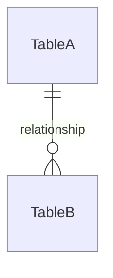
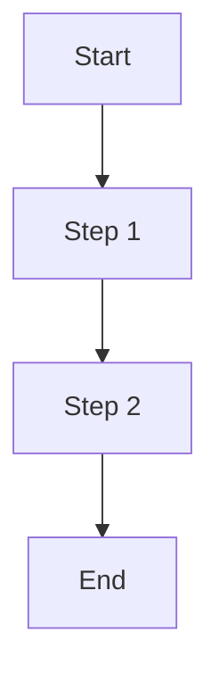

# Documentation Standard Template

This document defines the **standard format** for all technical documentation in this project. All documentation files MUST follow this structure for consistency.

---

## 📋 Document Types & Templates

### 1. Feature/Module Documentation Template

```markdown
# [Feature Name]

## 1. Overview
Brief description of the feature, its purpose, and how it fits into the system.

## 2. Goals & Requirements
### 2.1 Functional Requirements
- FR-001: Description
- FR-002: Description

### 2.2 Non-Functional Requirements
- NFR-001: Performance requirement
- NFR-002: Security requirement

## 3. Architecture
### 3.1 System Diagram
[Mermaid diagram or description]

### 3.2 Data Flow
[Sequence diagram or description]

## 4. Database Schema
### 4.1 Tables
[Table definitions]

### 4.2 Relationships
[ERD or description]

## 5. API Endpoints
| Method | Endpoint | Description | Auth |
|--------|----------|-------------|------|
| GET    | /api/... | ...         | Yes  |

## 6. Business Logic
### 6.1 [Process Name]
[Flowchart or step-by-step description]

## 7. Security Considerations
- Authentication requirements
- Authorization rules
- Data validation
- Rate limiting

## 8. Error Handling
| Error Code | Description | Resolution |
|------------|-------------|------------|
| E001       | ...         | ...        |

## 9. Testing Strategy
### 9.1 Unit Tests
### 9.2 Integration Tests
### 9.3 E2E Tests

## 10. Dependencies
- External services
- Third-party libraries
- Internal modules

## 11. Configuration
| Variable | Description | Default |
|----------|-------------|---------|
| VAR_NAME | ...         | ...     |

## 12. Deployment Notes
- Migration steps
- Feature flags
- Rollback plan
```

---

### 2. API Documentation Template

```markdown
# API: [Endpoint Group Name]

## Base URL
`/api/v1/[resource]`

## Authentication
[JWT required / Public / etc.]

## Endpoints

### [Method] /endpoint

**Description**: What this endpoint does

**Headers**:
| Header | Value | Required |
|--------|-------|----------|
| Authorization | Bearer {token} | Yes |

**Request Body**:
```json
{
  "field": "type - description"
}
```

**Response** (200 OK):
```json
{
  "success": true,
  "data": {}
}
```

**Error Responses**:
| Code | Message | Description |
|------|---------|-------------|
| 400  | ...     | ...         |
| 401  | ...     | ...         |

**Example**:
```bash
curl -X POST https://api.example.com/endpoint \
  -H "Authorization: Bearer token" \
  -d '{"field": "value"}'
```
```

---

### 3. Database Schema Template

```markdown
# Database: [Schema/Feature Name]

## Overview
Description of what this schema handles.

## Entity Relationship Diagram


## Tables

### [table_name]
**Purpose**: What this table stores

| Column | Type | Constraints | Description |
|--------|------|-------------|-------------|
| id | CHAR(36) | PK, NOT NULL | UUID primary key |
| created_at | DATETIME | NOT NULL, DEFAULT NOW() | Creation timestamp |

**Indexes**:
| Name | Columns | Type |
|------|---------|------|
| idx_name | column | BTREE |

**Relationships**:
- Belongs to `other_table` via `foreign_key_id`
- Has many `child_table`

## Prisma Schema
```prisma
model TableName {
  id String @id @default(uuid())
}
```

## Migrations
```sql
-- Migration: create_table_name
CREATE TABLE table_name (...);
```
```

---

### 4. Business Logic Documentation Template

```markdown
# Business Logic: [Process Name]

## 1. Overview
What business process this describes.

## 2. Actors
| Actor | Description |
|-------|-------------|
| Customer | End user making purchases |
| Admin | System administrator |

## 3. Process Flow

### 3.1 Happy Path


### 3.2 Alternative Flows
- **Alt-1**: If condition X, then...
- **Alt-2**: If condition Y, then...

## 4. Business Rules
| Rule ID | Rule | Implementation |
|---------|------|----------------|
| BR-001  | ...  | ...            |

## 5. Validations
| Field | Rule | Error Message |
|-------|------|---------------|
| email | Valid email format | "Invalid email" |

## 6. Calculations
### [Calculation Name]
```
Formula: result = (price * quantity) - discount
```

## 7. Edge Cases
- What if X is null?
- What if Y exceeds limit?

## 8. Audit & Logging
| Event | Data Logged |
|-------|-------------|
| Order created | order_id, user_id, timestamp |
```

---

### 5. Integration Documentation Template

```markdown
# Integration: [Service Name]

## 1. Overview
What external service this integrates with.

## 2. Provider Information
| Property | Value |
|----------|-------|
| Provider | Company Name |
| API Version | v2.0 |
| Documentation | https://docs.example.com |
| Sandbox | https://sandbox.example.com |
| Production | https://api.example.com |

## 3. Authentication
How to authenticate with the service.

## 4. Endpoints Used
| Our Action | Their Endpoint | Method |
|------------|----------------|--------|
| Create payment | /payments | POST |

## 5. Request/Response Mapping
### Our Request → Their Request
```json
{
  "ourField": "theirField"
}
```

## 6. Webhooks
| Event | Our Handler | Data |
|-------|-------------|------|
| payment.success | /webhooks/payment | {...} |

## 7. Error Handling
How we handle errors from this service.

## 8. Rate Limits
| Limit | Value |
|-------|-------|
| Requests/minute | 100 |

## 9. Testing
How to test the integration (sandbox credentials, mock data).

## 10. Fallback Strategy
What happens if the service is down.
```

---

## 📝 Writing Guidelines

### Formatting Rules
1. **Headers**: Use `#` for main title, `##` for sections, `###` for subsections
2. **Code blocks**: Always specify language (```typescript, ```sql, ```json)
3. **Tables**: Use for structured data, keep columns concise
4. **Diagrams**: Use Mermaid when possible

### Content Rules
1. **Be specific**: Include exact values, not vague descriptions
2. **Include examples**: Show real request/response examples
3. **Document edge cases**: What happens when things go wrong
4. **Version everything**: Note API versions, dependencies
5. **Keep updated**: Update docs when code changes

### Naming Conventions
| Type | Convention | Example |
|------|------------|---------|
| Files | lowercase_snake_case.md | `content_crawler.md` |
| Sections | Title Case | `## Business Logic` |
| Code | As per language | `createUser()` |
| Environment vars | SCREAMING_SNAKE | `DATABASE_URL` |

### Required Sections by Doc Type
| Doc Type | Required Sections |
|----------|-------------------|
| Feature | Overview, Requirements, Architecture, API, Security |
| API | Base URL, Auth, Endpoints, Errors, Examples |
| Database | ERD, Tables, Indexes, Prisma Schema |
| Business Logic | Flow, Rules, Validations, Edge Cases |
| Integration | Provider Info, Auth, Mapping, Errors |

---

## 🔗 Cross-Referencing

Use relative links to reference other docs:
```markdown
See [Database Schema](../database_schema.md) for table definitions.
See [API Specification](../api_specification.md#users) for endpoint details.
```

---

## 📁 File Organization

```
docs/
├── _doc_standard.md          # This file
├── project_overview.md       # General overview
├── database_schema.md        # All database tables
├── api_specification.md      # All API endpoints
├── auth_flow.md             # Authentication details
├── business_logic.md        # Core business rules
├── seo_analytics.md         # SEO & tracking
├── testing_deployment.md    # CI/CD & testing
│
├── features/                # Feature-specific docs
│   ├── content_crawler.md
│   ├── payment_integration.md
│   └── ...
│
├── integrations/            # Third-party integrations
│   ├── vnpay.md
│   ├── cloudinary.md
│   └── ...
│
└── ui_ux/                   # UI/UX specifications
    ├── _wireframe_standard.md
    ├── homepage.md
    └── ...
```
