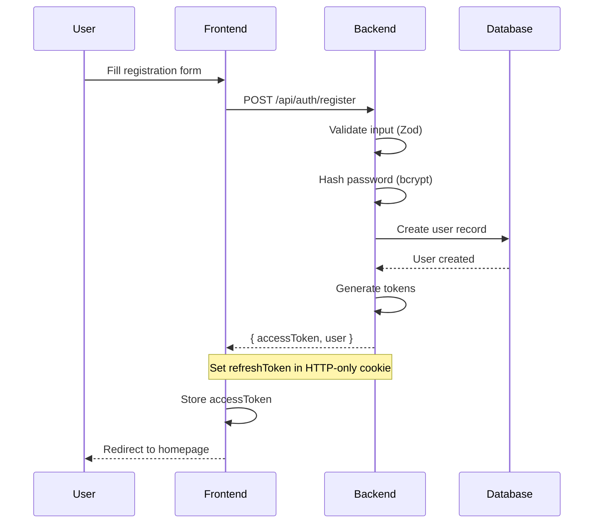
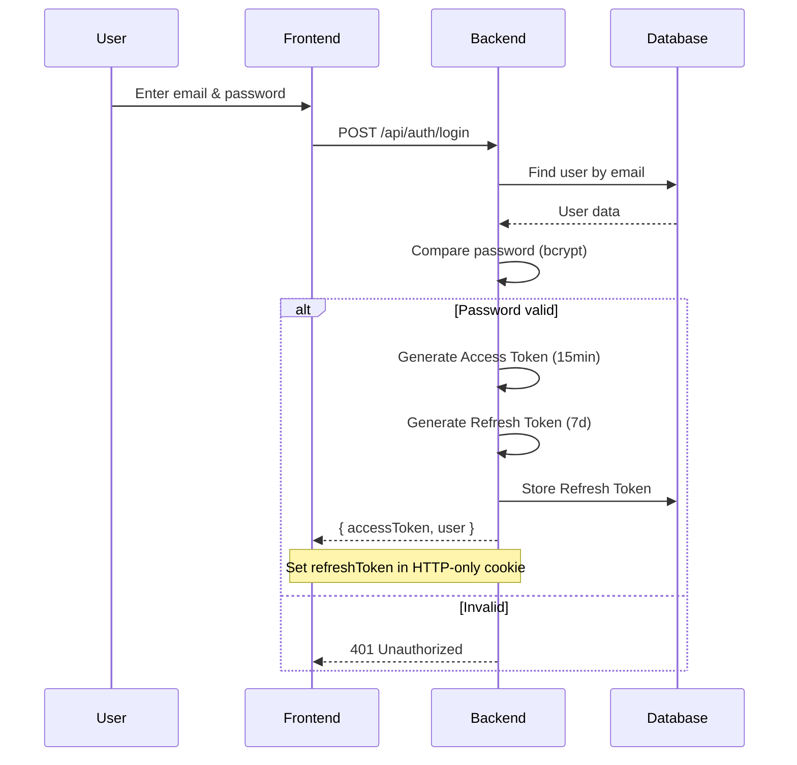
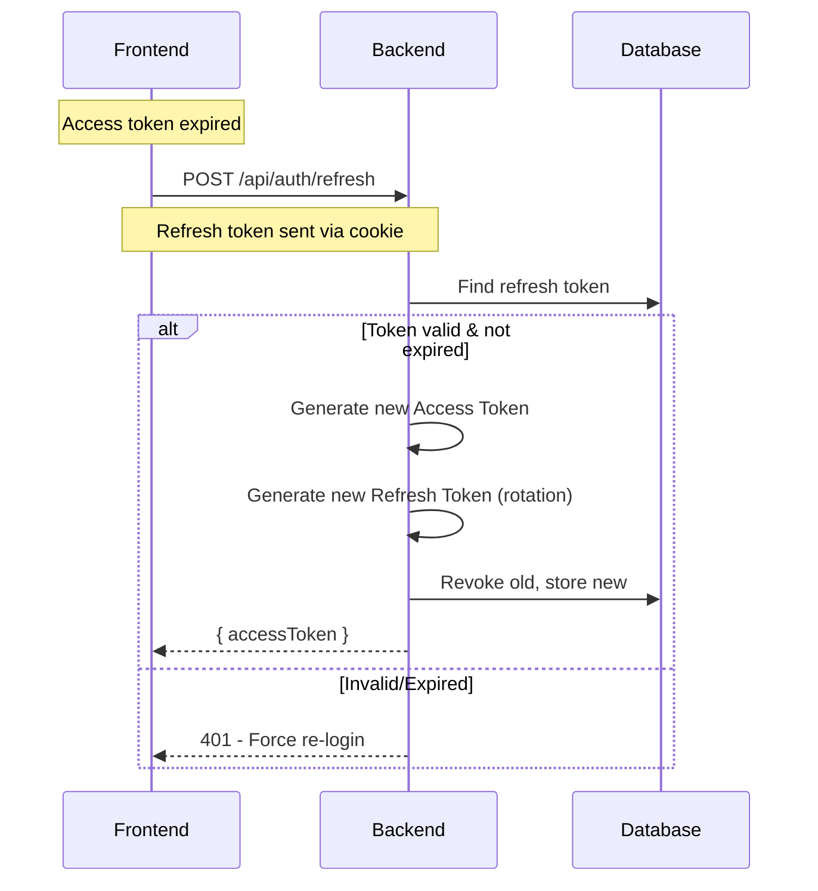
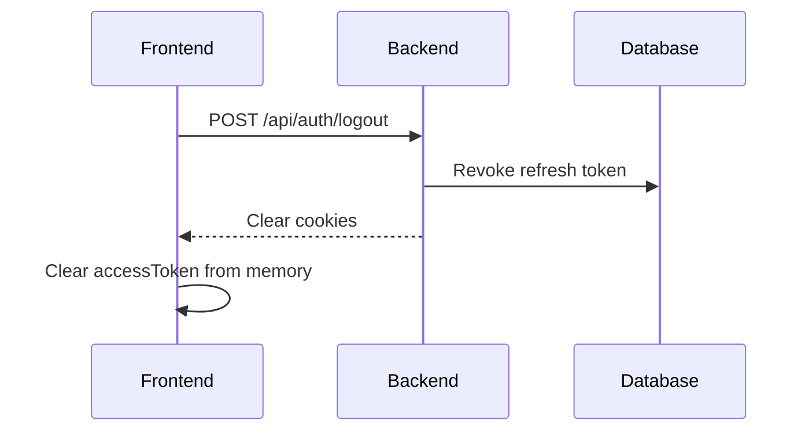
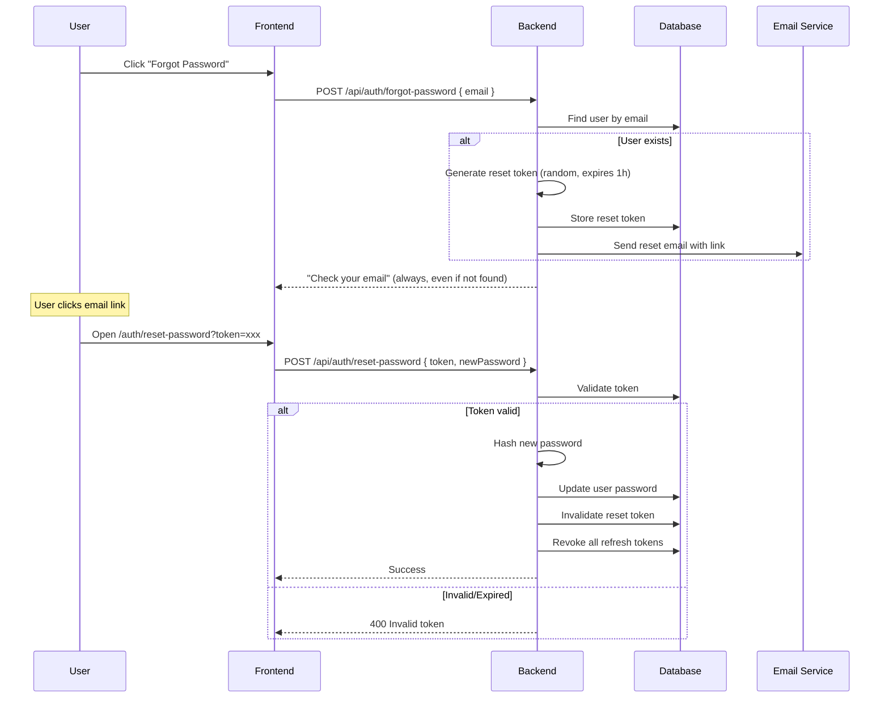
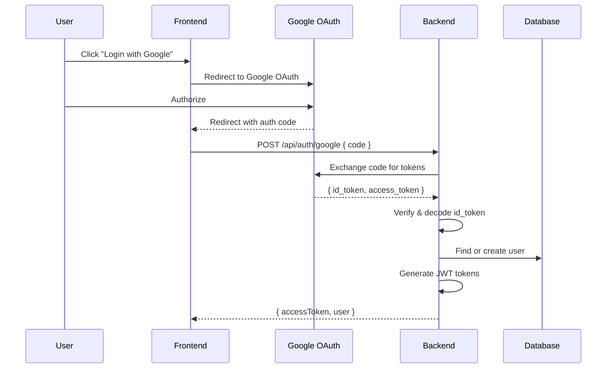

# Authentication & Authorization

## 1. Authentication Strategy: JWT + Refresh Token

### Why JWT + Refresh Token?
- **Stateless**: No session storage on server
- **Scalable**: Works across multiple server instances
- **Secure**: Short-lived access tokens + long-lived refresh tokens

### Token Configuration
| Token Type | Lifetime | Storage |
|------------|----------|---------|
| Access Token | 15 minutes | Memory / HTTP-only Cookie |
| Refresh Token | 7 days | HTTP-only Cookie + Database |

---

## 2. Authentication Flow

### 2.1 Registration


### 2.2 Login


### 2.3 Token Refresh


### 2.4 Logout


---

## 3. Password Reset Flow



---

## 4. Social Login (Optional - Google/Facebook)

### Flow


---

## 5. Authorization (Role-Based Access Control)

### Roles
| Role | Description |
|------|-------------|
| `customer` | Default. Can read content, purchase, comment |
| `editor` | Can create/edit articles, manage categories |
| `admin` | Full access: users, products, orders, settings |

### Permission Matrix
| Resource | Action | customer | editor | admin |
|----------|--------|----------|--------|-------|
| Articles | Read | ✅ | ✅ | ✅ |
| Articles | Create | ❌ | ✅ | ✅ |
| Articles | Update | ❌ | ✅ (own) | ✅ |
| Articles | Delete | ❌ | ❌ | ✅ |
| Products | Read | ✅ | ✅ | ✅ |
| Products | Create/Update/Delete | ❌ | ❌ | ✅ |
| Orders | Create | ✅ | ✅ | ✅ |
| Orders | View own | ✅ | ✅ | ✅ |
| Orders | View all | ❌ | ❌ | ✅ |
| Orders | Update status | ❌ | ❌ | ✅ |
| Users | Manage | ❌ | ❌ | ✅ |

### Middleware Example
```typescript
// middleware/auth.ts
export const requireAuth = async (req, res, next) => {
  const token = req.headers.authorization?.split(' ')[1];
  if (!token) return res.status(401).json({ error: 'Unauthorized' });
  
  try {
    const decoded = jwt.verify(token, process.env.JWT_SECRET);
    req.user = decoded;
    next();
  } catch {
    return res.status(401).json({ error: 'Invalid token' });
  }
};

export const requireRole = (...roles: Role[]) => {
  return (req, res, next) => {
    if (!roles.includes(req.user.role)) {
      return res.status(403).json({ error: 'Forbidden' });
    }
    next();
  };
};

// Usage
router.post('/articles', requireAuth, requireRole('editor', 'admin'), createArticle);
```

---

## 6. Security Best Practices

### Password Policy
- Minimum 8 characters
- At least 1 uppercase letter
- At least 1 number
- Hash with bcrypt (12 salt rounds)

### Token Security
- Access Token: Short-lived (15 min)
- Refresh Token: HTTP-only, Secure, SameSite=Strict cookie
- Refresh Token Rotation: New token on each refresh

### Rate Limiting
```typescript
// Login: 5 attempts per 15 minutes per IP
// Password reset: 3 requests per hour per email
// Register: 10 per hour per IP
```

### CORS Configuration
```typescript
app.use(cors({
  origin: process.env.FRONTEND_URL,
  credentials: true, // Allow cookies
}));
```
