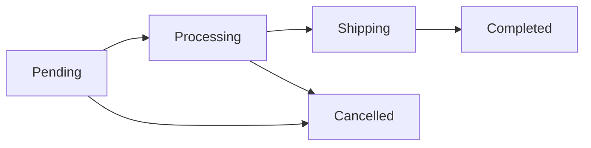

# Business Logic & Workflows

## 1. Order Workflow
The lifecycle of an order moves through the following states:

1.  **Pending**: Order created, awaiting payment confirmation.
2.  **Processing**: Payment successful (or COD confirmed), staff preparing items.
3.  **Shipping**: Handed over to logistics partner.
4.  **Completed**: Successfully delivered.
5.  **Cancelled**: Cancelled by user or admin (before shipping).



## 2. Inventory Management
*   **Add to Cart**: No stock reservation.
*   **Checkout (Create Order)**:
    *   Create a record in `stock_reservations`.
    *   Stock is "reserved" but not strictly deducted from `products.stock_quantity` display until paid, or deducted logically depending on implementation choice (common: deduct immediately and restore if unpaid).
    *   **Rule**: Auto-release stock if payment pending > 30 minutes.
*   **Payment Success**: Confirm deduction permanent.
*   **Cancellation**: Restore stock to `products` table.

## 3. Pricing Rules
*   **Base Price**: Use `sale_price` if valid, otherwise `price`.
*   **Quantity Discount**:
    *   Buy >= 5 items: **5% off**.
    *   Buy >= 10 items: **10% off**.

```javascript
function calculatePrice(product, quantity) {
  const base = product.sale_price || product.price;
  let total = base * quantity;
  if(quantity >= 10) return total * 0.90;
  if(quantity >= 5) return total * 0.95;
  return total;
}
```

## 4. Email Notifications
Triggers for sending emails:
1.  **Order Confirmation**: Sent immediately after `POST /api/orders` success.
2.  **Payment Success**: Sent when payment gateway webhook returns success.
3.  **Shipping Update**: When status changes to `shipping`.
4.  **Completed**: Thank you & Request review.
