# Database Schema (MySQL 8.0+ / PostgreSQL)

## 1. Entity Relationship Diagram (ERD)

```mermaid
erDiagram
    users ||--o{ articles : writes
    users ||--o{ orders : places
    users ||--o{ comments : writes
    users ||--o{ refresh_tokens : has
    users ||--o{ carts : has
    users ||--o{ wishlists : has
    users ||--o{ reading_history : has
    
    article_categories ||--o{ articles : classifies
    article_categories ||--o{ article_categories : parent
    
    product_categories ||--o{ products : classifies
    product_categories ||--o{ product_categories : parent
    
    tags ||--o{ article_tags : has
    tags ||--o{ product_tags : has
    articles ||--o{ article_tags : tagged
    products ||--o{ product_tags : tagged
    
    products ||--o{ product_attributes : has
    product_attributes ||--o{ product_attribute_values : has
    products ||--o{ product_variants : has
    product_variants ||--o{ variant_attribute_values : has
    product_attribute_values ||--o{ variant_attribute_values : has
    
    product_variants ||--o{ cart_items : in
    product_variants ||--o{ order_items : sold_as
    product_variants ||--o{ stock_reservations : reserves
    products ||--o{ wishlists : saved
    articles ||--o{ reading_history : read
    
    carts ||--o{ cart_items : contains
    orders ||--o{ order_items : contains
    orders ||--o{ order_coupons : uses
    articles ||--o{ comments : has
    
    coupons ||--o{ order_coupons : applied
    
    cities ||--o{ districts : has
    districts ||--o{ wards : has

    users {
        uuid id PK
        varchar255 email UK
        varchar20 phone
        varchar255 password_hash
        enum role
        varchar255 full_name
        varchar500 avatar_url
        timestamp created_at
        timestamp updated_at
    }

    article_categories {
        uuid id PK
        varchar255 name
        varchar255 slug UK
        text description
        varchar500 image
        uuid parent_id FK
        int sort_order
    }

    product_categories {
        uuid id PK
        varchar255 name
        varchar255 slug UK
        varchar500 image
        text description
        uuid parent_id FK
        int sort_order
    }

    tags {
        uuid id PK
        varchar100 name
        varchar100 slug UK
        enum type
    }

    articles {
        uuid id PK
        varchar500 title
        varchar500 slug UK
        text excerpt
        longtext content
        varchar500 featured_image
        uuid author_id FK
        uuid category_id FK
        enum status
        boolean is_featured
        boolean is_notable
        int view_count
        timestamp published_at
    }

    products {
        uuid id PK
        varchar500 name
        varchar500 slug UK
        text description
        varchar1000 short_description
        json images
        uuid category_id FK
        enum status
        boolean is_featured
        boolean has_variants
    }

    product_attributes {
        uuid id PK
        uuid product_id FK
        varchar100 name
        int sort_order
    }

    product_attribute_values {
        uuid id PK
        uuid attribute_id FK
        varchar100 value
        int sort_order
    }

    product_variants {
        uuid id PK
        uuid product_id FK
        varchar100 sku UK
        decimal price
        decimal sale_price
        int stock_quantity
        boolean is_default
        int sort_order
    }

    variant_attribute_values {
        uuid variant_id FK
        uuid attribute_value_id FK
    }

    carts {
        uuid id PK
        uuid user_id FK
        varchar255 session_id
        timestamp expires_at
        timestamp updated_at
    }

    cart_items {
        uuid id PK
        uuid cart_id FK
        uuid variant_id FK
        int quantity
    }

    orders {
        uuid id PK
        uuid user_id FK
        varchar50 order_number UK
        decimal total_amount
        decimal discount_amount
        enum status
        enum payment_method
        enum payment_status
        varchar255 shipping_name
        varchar20 shipping_phone
        text shipping_address
        uuid city_id FK
        uuid district_id FK
        uuid ward_id FK
        text note
    }

    order_items {
        uuid id PK
        uuid order_id FK
        uuid variant_id FK
        varchar500 product_name
        varchar255 variant_name
        decimal product_price
        int quantity
        decimal subtotal
    }
    
    wishlists {
        uuid id PK
        uuid user_id FK
        uuid product_id FK
        timestamp created_at
    }
    
    coupons {
        uuid id PK
        varchar50 code UK
        enum type
        decimal value
        decimal min_order
        decimal max_discount
        int usage_limit
        int used_count
        timestamp starts_at
        timestamp expires_at
        boolean is_active
    }
    
    order_coupons {
        uuid order_id FK
        uuid coupon_id FK
        decimal discount_applied
    }
    
    cities {
        uuid id PK
        varchar100 name
        varchar20 code UK
        int sort_order
    }
    
    districts {
        uuid id PK
        uuid city_id FK
        varchar100 name
        varchar20 code UK
        int sort_order
    }
    
    wards {
        uuid id PK
        uuid district_id FK
        varchar100 name
        varchar20 code UK
        int sort_order
    }
    
    reading_history {
        uuid id PK
        uuid user_id FK
        uuid article_id FK
        int read_percentage
        int time_spent
        timestamp read_at
    }
```



---

## 2. Table Definitions (MySQL Syntax)

### `users`
```sql
CREATE TABLE users (
  id CHAR(36) PRIMARY KEY DEFAULT (UUID()),
  email VARCHAR(255) UNIQUE NOT NULL,
  phone VARCHAR(20),
  password_hash VARCHAR(255) NOT NULL,
  full_name VARCHAR(255),
  role ENUM('admin', 'editor', 'customer') DEFAULT 'customer',
  avatar_url VARCHAR(500),
  email_verified_at TIMESTAMP NULL,
  created_at TIMESTAMP DEFAULT CURRENT_TIMESTAMP,
  updated_at TIMESTAMP DEFAULT CURRENT_TIMESTAMP ON UPDATE CURRENT_TIMESTAMP,
  
  INDEX idx_users_email (email),
  INDEX idx_users_phone (phone),
  INDEX idx_users_role (role)
) ENGINE=InnoDB DEFAULT CHARSET=utf8mb4 COLLATE=utf8mb4_unicode_ci;
```

### `article_categories`
```sql
CREATE TABLE article_categories (
  id CHAR(36) PRIMARY KEY DEFAULT (UUID()),
  name VARCHAR(255) NOT NULL,
  slug VARCHAR(255) UNIQUE NOT NULL,
  description TEXT,
  image VARCHAR(500), -- Category image for UI display
  parent_id CHAR(36) NULL,
  sort_order INT DEFAULT 0,
  created_at TIMESTAMP DEFAULT CURRENT_TIMESTAMP,
  
  FOREIGN KEY (parent_id) REFERENCES article_categories(id) ON DELETE SET NULL,
  INDEX idx_article_categories_slug (slug),
  INDEX idx_article_categories_parent (parent_id)
) ENGINE=InnoDB DEFAULT CHARSET=utf8mb4 COLLATE=utf8mb4_unicode_ci;
```

### `product_categories`
```sql
CREATE TABLE product_categories (
  id CHAR(36) PRIMARY KEY DEFAULT (UUID()),
  name VARCHAR(255) NOT NULL,
  slug VARCHAR(255) UNIQUE NOT NULL,
  image VARCHAR(500),
  description TEXT,
  parent_id CHAR(36) NULL,
  sort_order INT DEFAULT 0,
  created_at TIMESTAMP DEFAULT CURRENT_TIMESTAMP,
  
  FOREIGN KEY (parent_id) REFERENCES product_categories(id) ON DELETE SET NULL,
  INDEX idx_product_categories_slug (slug),
  INDEX idx_product_categories_parent (parent_id)
) ENGINE=InnoDB DEFAULT CHARSET=utf8mb4 COLLATE=utf8mb4_unicode_ci;
```

### `tags`
```sql
CREATE TABLE tags (
  id CHAR(36) PRIMARY KEY DEFAULT (UUID()),
  name VARCHAR(100) NOT NULL,
  slug VARCHAR(100) UNIQUE NOT NULL,
  type ENUM('article', 'product', 'both') DEFAULT 'both',
  created_at TIMESTAMP DEFAULT CURRENT_TIMESTAMP,
  
  INDEX idx_tags_slug (slug),
  INDEX idx_tags_type (type)
) ENGINE=InnoDB DEFAULT CHARSET=utf8mb4 COLLATE=utf8mb4_unicode_ci;
```

### `article_tags`
```sql
CREATE TABLE article_tags (
  article_id CHAR(36) NOT NULL,
  tag_id CHAR(36) NOT NULL,
  
  PRIMARY KEY (article_id, tag_id),
  FOREIGN KEY (article_id) REFERENCES articles(id) ON DELETE CASCADE,
  FOREIGN KEY (tag_id) REFERENCES tags(id) ON DELETE CASCADE
) ENGINE=InnoDB DEFAULT CHARSET=utf8mb4 COLLATE=utf8mb4_unicode_ci;
```

### `product_tags`
```sql
CREATE TABLE product_tags (
  product_id CHAR(36) NOT NULL,
  tag_id CHAR(36) NOT NULL,
  
  PRIMARY KEY (product_id, tag_id),
  FOREIGN KEY (product_id) REFERENCES products(id) ON DELETE CASCADE,
  FOREIGN KEY (tag_id) REFERENCES tags(id) ON DELETE CASCADE
) ENGINE=InnoDB DEFAULT CHARSET=utf8mb4 COLLATE=utf8mb4_unicode_ci;
```

### `articles`
```sql
CREATE TABLE articles (
  id CHAR(36) PRIMARY KEY DEFAULT (UUID()),
  title VARCHAR(500) NOT NULL,
  slug VARCHAR(500) UNIQUE NOT NULL,
  excerpt TEXT,
  content LONGTEXT NOT NULL,
  featured_image VARCHAR(500),
  author_id CHAR(36),
  category_id CHAR(36),
  status ENUM('draft', 'published', 'archived') DEFAULT 'draft',
  is_featured BOOLEAN DEFAULT FALSE,
  is_notable BOOLEAN DEFAULT FALSE, -- Editor's picks / Đáng chú ý
  view_count INT UNSIGNED DEFAULT 0,
  meta_title VARCHAR(255),
  meta_description TEXT,
  published_at TIMESTAMP NULL,
  created_at TIMESTAMP DEFAULT CURRENT_TIMESTAMP,
  updated_at TIMESTAMP DEFAULT CURRENT_TIMESTAMP ON UPDATE CURRENT_TIMESTAMP,
  
  FOREIGN KEY (author_id) REFERENCES users(id) ON DELETE SET NULL,
  FOREIGN KEY (category_id) REFERENCES article_categories(id) ON DELETE SET NULL,
  INDEX idx_articles_slug (slug),
  INDEX idx_articles_status (status),
  INDEX idx_articles_category (category_id),
  INDEX idx_articles_published (published_at),
  INDEX idx_articles_featured (is_featured),
  INDEX idx_articles_notable (is_notable),
  FULLTEXT INDEX ft_articles_search (title, excerpt, content)
) ENGINE=InnoDB DEFAULT CHARSET=utf8mb4 COLLATE=utf8mb4_unicode_ci;
```

### `products`
```sql
CREATE TABLE products (
  id CHAR(36) PRIMARY KEY DEFAULT (UUID()),
  name VARCHAR(500) NOT NULL,
  slug VARCHAR(500) UNIQUE NOT NULL,
  description TEXT,
  short_description VARCHAR(1000),
  images JSON, -- Array of image URLs
  category_id CHAR(36),
  status ENUM('active', 'inactive', 'out_of_stock') DEFAULT 'active',
  is_featured BOOLEAN DEFAULT FALSE,
  has_variants BOOLEAN DEFAULT FALSE, -- TRUE if product has multiple variants
  meta_title VARCHAR(255),
  meta_description TEXT,
  created_at TIMESTAMP DEFAULT CURRENT_TIMESTAMP,
  updated_at TIMESTAMP DEFAULT CURRENT_TIMESTAMP ON UPDATE CURRENT_TIMESTAMP,
  
  FOREIGN KEY (category_id) REFERENCES product_categories(id) ON DELETE SET NULL,
  INDEX idx_products_slug (slug),
  INDEX idx_products_status (status),
  INDEX idx_products_category (category_id),
  INDEX idx_products_featured (is_featured),
  FULLTEXT INDEX ft_products_search (name, description)
) ENGINE=InnoDB DEFAULT CHARSET=utf8mb4 COLLATE=utf8mb4_unicode_ci;
```

### `product_attributes` (e.g., "Đóng gói", "Màu sắc")
```sql
CREATE TABLE product_attributes (
  id CHAR(36) PRIMARY KEY DEFAULT (UUID()),
  product_id CHAR(36) NOT NULL,
  name VARCHAR(100) NOT NULL, -- e.g., "Đóng gói", "Màu sắc"
  sort_order INT DEFAULT 0,
  created_at TIMESTAMP DEFAULT CURRENT_TIMESTAMP,
  
  FOREIGN KEY (product_id) REFERENCES products(id) ON DELETE CASCADE,
  INDEX idx_product_attributes_product (product_id)
) ENGINE=InnoDB DEFAULT CHARSET=utf8mb4 COLLATE=utf8mb4_unicode_ci;
```

### `product_attribute_values` (e.g., "Hộp 30V", "Hộp 60V", "Màu đỏ")
```sql
CREATE TABLE product_attribute_values (
  id CHAR(36) PRIMARY KEY DEFAULT (UUID()),
  attribute_id CHAR(36) NOT NULL,
  value VARCHAR(100) NOT NULL, -- e.g., "Hộp 30V", "Màu đỏ"
  sort_order INT DEFAULT 0,
  created_at TIMESTAMP DEFAULT CURRENT_TIMESTAMP,
  
  FOREIGN KEY (attribute_id) REFERENCES product_attributes(id) ON DELETE CASCADE,
  INDEX idx_attribute_values_attr (attribute_id)
) ENGINE=InnoDB DEFAULT CHARSET=utf8mb4 COLLATE=utf8mb4_unicode_ci;
```

### `product_variants` (Combination of attribute values with price)
```sql
CREATE TABLE product_variants (
  id CHAR(36) PRIMARY KEY DEFAULT (UUID()),
  product_id CHAR(36) NOT NULL,
  sku VARCHAR(100) UNIQUE,
  price DECIMAL(15,2) NOT NULL,
  sale_price DECIMAL(15,2) NULL,
  stock_quantity INT UNSIGNED DEFAULT 0,
  is_default BOOLEAN DEFAULT FALSE, -- Default variant to display
  sort_order INT DEFAULT 0,
  created_at TIMESTAMP DEFAULT CURRENT_TIMESTAMP,
  updated_at TIMESTAMP DEFAULT CURRENT_TIMESTAMP ON UPDATE CURRENT_TIMESTAMP,
  
  FOREIGN KEY (product_id) REFERENCES products(id) ON DELETE CASCADE,
  INDEX idx_variants_product (product_id),
  INDEX idx_variants_sku (sku)
) ENGINE=InnoDB DEFAULT CHARSET=utf8mb4 COLLATE=utf8mb4_unicode_ci;
```

### `variant_attribute_values` (Maps variant to its attribute values)
```sql
CREATE TABLE variant_attribute_values (
  variant_id CHAR(36) NOT NULL,
  attribute_value_id CHAR(36) NOT NULL,
  
  PRIMARY KEY (variant_id, attribute_value_id),
  FOREIGN KEY (variant_id) REFERENCES product_variants(id) ON DELETE CASCADE,
  FOREIGN KEY (attribute_value_id) REFERENCES product_attribute_values(id) ON DELETE CASCADE
) ENGINE=InnoDB DEFAULT CHARSET=utf8mb4 COLLATE=utf8mb4_unicode_ci;
```

### `carts`
```sql
CREATE TABLE carts (
  id CHAR(36) PRIMARY KEY DEFAULT (UUID()),
  user_id CHAR(36) NULL, -- NULL for guest carts
  session_id VARCHAR(255) NULL, -- For guest identification
  expires_at TIMESTAMP NULL, -- Auto-cleanup guest carts
  created_at TIMESTAMP DEFAULT CURRENT_TIMESTAMP,
  updated_at TIMESTAMP DEFAULT CURRENT_TIMESTAMP ON UPDATE CURRENT_TIMESTAMP,
  
  FOREIGN KEY (user_id) REFERENCES users(id) ON DELETE CASCADE,
  INDEX idx_carts_user (user_id),
  INDEX idx_carts_session (session_id),
  INDEX idx_carts_expires (expires_at)
) ENGINE=InnoDB DEFAULT CHARSET=utf8mb4 COLLATE=utf8mb4_unicode_ci;
```

### `cart_items`
```sql
CREATE TABLE cart_items (
  id CHAR(36) PRIMARY KEY DEFAULT (UUID()),
  cart_id CHAR(36) NOT NULL,
  variant_id CHAR(36) NOT NULL,
  quantity INT UNSIGNED NOT NULL DEFAULT 1,
  created_at TIMESTAMP DEFAULT CURRENT_TIMESTAMP,
  updated_at TIMESTAMP DEFAULT CURRENT_TIMESTAMP ON UPDATE CURRENT_TIMESTAMP,
  
  FOREIGN KEY (cart_id) REFERENCES carts(id) ON DELETE CASCADE,
  FOREIGN KEY (variant_id) REFERENCES product_variants(id) ON DELETE CASCADE,
  UNIQUE KEY unique_cart_variant (cart_id, variant_id),
  INDEX idx_cart_items_cart (cart_id)
) ENGINE=InnoDB DEFAULT CHARSET=utf8mb4 COLLATE=utf8mb4_unicode_ci;
```

### `orders`
```sql
CREATE TABLE orders (
  id CHAR(36) PRIMARY KEY DEFAULT (UUID()),
  user_id CHAR(36),
  order_number VARCHAR(50) UNIQUE NOT NULL,
  total_amount DECIMAL(15,2) NOT NULL,
  status ENUM('pending', 'processing', 'shipping', 'completed', 'cancelled') DEFAULT 'pending',
  payment_method ENUM('vnpay', 'momo', 'cod') DEFAULT 'cod',
  payment_status ENUM('unpaid', 'paid', 'refunded') DEFAULT 'unpaid',
  
  -- Shipping info
  shipping_name VARCHAR(255) NOT NULL,
  shipping_phone VARCHAR(20) NOT NULL,
  shipping_address TEXT NOT NULL,
  shipping_city VARCHAR(100),
  shipping_district VARCHAR(100),
  shipping_ward VARCHAR(100),
  
  note TEXT,
  created_at TIMESTAMP DEFAULT CURRENT_TIMESTAMP,
  updated_at TIMESTAMP DEFAULT CURRENT_TIMESTAMP ON UPDATE CURRENT_TIMESTAMP,
  
  FOREIGN KEY (user_id) REFERENCES users(id) ON DELETE SET NULL,
  INDEX idx_orders_user (user_id),
  INDEX idx_orders_status (status),
  INDEX idx_orders_number (order_number),
  INDEX idx_orders_created (created_at)
) ENGINE=InnoDB DEFAULT CHARSET=utf8mb4 COLLATE=utf8mb4_unicode_ci;
```

### `order_items`
```sql
CREATE TABLE order_items (
  id CHAR(36) PRIMARY KEY DEFAULT (UUID()),
  order_id CHAR(36) NOT NULL,
  variant_id CHAR(36),
  product_name VARCHAR(500) NOT NULL, -- Snapshot
  variant_name VARCHAR(255), -- Snapshot: "Hộp 60V, Màu đỏ"
  product_price DECIMAL(15,2) NOT NULL, -- Snapshot
  quantity INT UNSIGNED NOT NULL,
  subtotal DECIMAL(15,2) NOT NULL,
  created_at TIMESTAMP DEFAULT CURRENT_TIMESTAMP,
  
  FOREIGN KEY (order_id) REFERENCES orders(id) ON DELETE CASCADE,
  FOREIGN KEY (variant_id) REFERENCES product_variants(id) ON DELETE SET NULL,
  INDEX idx_order_items_order (order_id)
) ENGINE=InnoDB DEFAULT CHARSET=utf8mb4 COLLATE=utf8mb4_unicode_ci;
```

### `comments`
```sql
CREATE TABLE comments (
  id CHAR(36) PRIMARY KEY DEFAULT (UUID()),
  article_id CHAR(36) NOT NULL,
  user_id CHAR(36),
  content TEXT NOT NULL,
  parent_id CHAR(36) NULL, -- For nested comments
  status ENUM('pending', 'approved', 'rejected') DEFAULT 'pending',
  created_at TIMESTAMP DEFAULT CURRENT_TIMESTAMP,
  
  FOREIGN KEY (article_id) REFERENCES articles(id) ON DELETE CASCADE,
  FOREIGN KEY (user_id) REFERENCES users(id) ON DELETE SET NULL,
  FOREIGN KEY (parent_id) REFERENCES comments(id) ON DELETE CASCADE,
  INDEX idx_comments_article (article_id),
  INDEX idx_comments_status (status)
) ENGINE=InnoDB DEFAULT CHARSET=utf8mb4 COLLATE=utf8mb4_unicode_ci;
```

### `refresh_tokens` (For JWT Auth)
```sql
CREATE TABLE refresh_tokens (
  id CHAR(36) PRIMARY KEY DEFAULT (UUID()),
  user_id CHAR(36) NOT NULL,
  token VARCHAR(500) UNIQUE NOT NULL,
  expires_at TIMESTAMP NOT NULL,
  is_revoked BOOLEAN DEFAULT FALSE,
  created_at TIMESTAMP DEFAULT CURRENT_TIMESTAMP,
  
  FOREIGN KEY (user_id) REFERENCES users(id) ON DELETE CASCADE,
  INDEX idx_refresh_tokens_user (user_id),
  INDEX idx_refresh_tokens_token (token)
) ENGINE=InnoDB DEFAULT CHARSET=utf8mb4 COLLATE=utf8mb4_unicode_ci;
```

### `stock_reservations` (Inventory Management)
```sql
CREATE TABLE stock_reservations (
  id CHAR(36) PRIMARY KEY DEFAULT (UUID()),
  variant_id CHAR(36) NOT NULL,
  order_id CHAR(36) NOT NULL,
  quantity INT UNSIGNED NOT NULL,
  expires_at TIMESTAMP NOT NULL, -- Auto-release after 30 minutes
  created_at TIMESTAMP DEFAULT CURRENT_TIMESTAMP,
  
  FOREIGN KEY (variant_id) REFERENCES product_variants(id) ON DELETE CASCADE,
  FOREIGN KEY (order_id) REFERENCES orders(id) ON DELETE CASCADE,
  INDEX idx_stock_reservations_expires (expires_at)
) ENGINE=InnoDB DEFAULT CHARSET=utf8mb4 COLLATE=utf8mb4_unicode_ci;
```

### `wishlists` (User Favorites)
```sql
CREATE TABLE wishlists (
  id CHAR(36) PRIMARY KEY DEFAULT (UUID()),
  user_id CHAR(36) NOT NULL,
  product_id CHAR(36) NOT NULL,
  created_at TIMESTAMP DEFAULT CURRENT_TIMESTAMP,
  
  FOREIGN KEY (user_id) REFERENCES users(id) ON DELETE CASCADE,
  FOREIGN KEY (product_id) REFERENCES products(id) ON DELETE CASCADE,
  UNIQUE KEY unique_user_product (user_id, product_id),
  INDEX idx_wishlists_user (user_id)
) ENGINE=InnoDB DEFAULT CHARSET=utf8mb4 COLLATE=utf8mb4_unicode_ci;
```

### `coupons` (Discount Codes)
```sql
CREATE TABLE coupons (
  id CHAR(36) PRIMARY KEY DEFAULT (UUID()),
  code VARCHAR(50) UNIQUE NOT NULL,
  type ENUM('percentage', 'fixed') NOT NULL, -- percentage = %, fixed = VND
  value DECIMAL(15,2) NOT NULL, -- 10 for 10%, 50000 for 50k VND
  min_order DECIMAL(15,2) DEFAULT 0, -- Minimum order amount
  max_discount DECIMAL(15,2) NULL, -- Cap for percentage discounts
  usage_limit INT UNSIGNED NULL, -- NULL = unlimited
  used_count INT UNSIGNED DEFAULT 0,
  starts_at TIMESTAMP NULL, -- NULL = immediately active
  expires_at TIMESTAMP NULL, -- NULL = never expires
  is_active BOOLEAN DEFAULT TRUE,
  created_at TIMESTAMP DEFAULT CURRENT_TIMESTAMP,
  updated_at TIMESTAMP DEFAULT CURRENT_TIMESTAMP ON UPDATE CURRENT_TIMESTAMP,
  
  INDEX idx_coupons_code (code),
  INDEX idx_coupons_active (is_active, starts_at, expires_at)
) ENGINE=InnoDB DEFAULT CHARSET=utf8mb4 COLLATE=utf8mb4_unicode_ci;
```

### `order_coupons` (Applied Coupons)
```sql
CREATE TABLE order_coupons (
  order_id CHAR(36) NOT NULL,
  coupon_id CHAR(36) NOT NULL,
  discount_applied DECIMAL(15,2) NOT NULL, -- Actual discount amount
  created_at TIMESTAMP DEFAULT CURRENT_TIMESTAMP,
  
  PRIMARY KEY (order_id, coupon_id),
  FOREIGN KEY (order_id) REFERENCES orders(id) ON DELETE CASCADE,
  FOREIGN KEY (coupon_id) REFERENCES coupons(id) ON DELETE RESTRICT
) ENGINE=InnoDB DEFAULT CHARSET=utf8mb4 COLLATE=utf8mb4_unicode_ci;
```

### `cities` (Tỉnh/Thành phố)
```sql
CREATE TABLE cities (
  id CHAR(36) PRIMARY KEY DEFAULT (UUID()),
  name VARCHAR(100) NOT NULL,
  code VARCHAR(20) UNIQUE NOT NULL, -- e.g., "HN", "HCM"
  sort_order INT DEFAULT 0,
  created_at TIMESTAMP DEFAULT CURRENT_TIMESTAMP,
  
  INDEX idx_cities_code (code)
) ENGINE=InnoDB DEFAULT CHARSET=utf8mb4 COLLATE=utf8mb4_unicode_ci;
```

### `districts` (Quận/Huyện)
```sql
CREATE TABLE districts (
  id CHAR(36) PRIMARY KEY DEFAULT (UUID()),
  city_id CHAR(36) NOT NULL,
  name VARCHAR(100) NOT NULL,
  code VARCHAR(20) UNIQUE NOT NULL,
  sort_order INT DEFAULT 0,
  created_at TIMESTAMP DEFAULT CURRENT_TIMESTAMP,
  
  FOREIGN KEY (city_id) REFERENCES cities(id) ON DELETE CASCADE,
  INDEX idx_districts_city (city_id)
) ENGINE=InnoDB DEFAULT CHARSET=utf8mb4 COLLATE=utf8mb4_unicode_ci;
```

### `wards` (Phường/Xã)
```sql
CREATE TABLE wards (
  id CHAR(36) PRIMARY KEY DEFAULT (UUID()),
  district_id CHAR(36) NOT NULL,
  name VARCHAR(100) NOT NULL,
  code VARCHAR(20) UNIQUE NOT NULL,
  sort_order INT DEFAULT 0,
  created_at TIMESTAMP DEFAULT CURRENT_TIMESTAMP,
  
  FOREIGN KEY (district_id) REFERENCES districts(id) ON DELETE CASCADE,
  INDEX idx_wards_district (district_id)
) ENGINE=InnoDB DEFAULT CHARSET=utf8mb4 COLLATE=utf8mb4_unicode_ci;
```

### `reading_history` (Personalization)
```sql
CREATE TABLE reading_history (
  id CHAR(36) PRIMARY KEY DEFAULT (UUID()),
  user_id CHAR(36) NOT NULL,
  article_id CHAR(36) NOT NULL,
  read_percentage INT UNSIGNED DEFAULT 0, -- 0-100
  time_spent INT UNSIGNED DEFAULT 0, -- Seconds spent reading
  read_at TIMESTAMP DEFAULT CURRENT_TIMESTAMP,
  
  FOREIGN KEY (user_id) REFERENCES users(id) ON DELETE CASCADE,
  FOREIGN KEY (article_id) REFERENCES articles(id) ON DELETE CASCADE,
  UNIQUE KEY unique_user_article (user_id, article_id),
  INDEX idx_reading_history_user (user_id),
  INDEX idx_reading_history_article (article_id)
) ENGINE=InnoDB DEFAULT CHARSET=utf8mb4 COLLATE=utf8mb4_unicode_ci;
```

---

## 3. Product Variant Example

### Sản phẩm: "Vitamin C 1000mg"

**Attributes (max 2):**
| Thuộc tính | Giá trị |
|------------|---------|
| Đóng gói | Hộp 30V, Hộp 60V, Hộp 100V |
| Màu sắc | Đỏ, Xanh |

**Variants (combinations):**
| SKU | Đóng gói | Màu sắc | Giá | Giá KM | Tồn |
|-----|----------|---------|-----|--------|-----|
| VIT-C-30-RED | Hộp 30V | Đỏ | 150,000 | 120,000 | 50 |
| VIT-C-30-BLUE | Hộp 30V | Xanh | 150,000 | - | 30 |
| VIT-C-60-RED | Hộp 60V | Đỏ | 280,000 | 250,000 | 100 |
| VIT-C-60-BLUE | Hộp 60V | Xanh | 280,000 | - | 80 |
| VIT-C-100-RED | Hộp 100V | Đỏ | 450,000 | 400,000 | 20 |

### Data Structure:
```json
{
  "product": {
    "id": "prod-1",
    "name": "Vitamin C 1000mg",
    "has_variants": true,
    "attributes": [
      {
        "name": "Đóng gói",
        "values": ["Hộp 30V", "Hộp 60V", "Hộp 100V"]
      },
      {
        "name": "Màu sắc",
        "values": ["Đỏ", "Xanh"]
      }
    ],
    "variants": [
      {
        "sku": "VIT-C-30-RED",
        "attributes": {"Đóng gói": "Hộp 30V", "Màu sắc": "Đỏ"},
        "price": 150000,
        "sale_price": 120000,
        "stock": 50,
        "is_default": true
      }
    ]
  }
}
```

---

## 4. Finding Related Products via Tags

```sql
-- Find products related to an article via shared tags
SELECT DISTINCT p.*, pv.price, pv.sale_price
FROM products p
JOIN product_variants pv ON p.id = pv.product_id AND pv.is_default = TRUE
JOIN product_tags pt ON p.id = pt.product_id
JOIN article_tags at ON pt.tag_id = at.tag_id
WHERE at.article_id = :article_id
  AND p.status = 'active'
ORDER BY p.is_featured DESC
LIMIT 5;
```

---

## 5. Prisma Schema

```prisma
// prisma/schema.prisma
generator client {
  provider = "prisma-client-js"
}

datasource db {
  provider = "mysql" // or "postgresql"
  url      = env("DATABASE_URL")
}

model User {
  id              String    @id @default(uuid()) @db.Char(36)
  email           String    @unique @db.VarChar(255)
  phone           String?   @db.VarChar(20)
  passwordHash    String    @map("password_hash") @db.VarChar(255)
  fullName        String?   @map("full_name") @db.VarChar(255)
  role            Role      @default(customer)
  avatarUrl       String?   @map("avatar_url") @db.VarChar(500)
  emailVerifiedAt DateTime? @map("email_verified_at")
  createdAt       DateTime  @default(now()) @map("created_at")
  updatedAt       DateTime  @updatedAt @map("updated_at")

  articles       Article[]
  orders         Order[]
  comments       Comment[]
  refreshTokens  RefreshToken[]
  carts          Cart[]
  wishlists      Wishlist[]
  readingHistory ReadingHistory[]

  @@map("users")
}

enum Role {
  admin
  editor
  customer
}

model ArticleCategory {
  id          String            @id @default(uuid()) @db.Char(36)
  name        String            @db.VarChar(255)
  slug        String            @unique @db.VarChar(255)
  description String?           @db.Text
  image       String?           @db.VarChar(500)
  parentId    String?           @map("parent_id") @db.Char(36)
  sortOrder   Int               @default(0) @map("sort_order")
  createdAt   DateTime          @default(now()) @map("created_at")

  parent   ArticleCategory?  @relation("ArticleCategoryTree", fields: [parentId], references: [id])
  children ArticleCategory[] @relation("ArticleCategoryTree")
  articles Article[]

  @@map("article_categories")
}

model ProductCategory {
  id          String            @id @default(uuid()) @db.Char(36)
  name        String            @db.VarChar(255)
  slug        String            @unique @db.VarChar(255)
  image       String?           @db.VarChar(500)
  description String?           @db.Text
  parentId    String?           @map("parent_id") @db.Char(36)
  sortOrder   Int               @default(0) @map("sort_order")
  createdAt   DateTime          @default(now()) @map("created_at")

  parent   ProductCategory?  @relation("ProductCategoryTree", fields: [parentId], references: [id])
  children ProductCategory[] @relation("ProductCategoryTree")
  products Product[]

  @@map("product_categories")
}

model Tag {
  id        String       @id @default(uuid()) @db.Char(36)
  name      String       @db.VarChar(100)
  slug      String       @unique @db.VarChar(100)
  type      TagType      @default(both)
  createdAt DateTime     @default(now()) @map("created_at")

  articles ArticleTag[]
  products ProductTag[]

  @@map("tags")
}

enum TagType {
  article
  product
  both
}

model ArticleTag {
  articleId String @map("article_id") @db.Char(36)
  tagId     String @map("tag_id") @db.Char(36)

  article Article @relation(fields: [articleId], references: [id], onDelete: Cascade)
  tag     Tag     @relation(fields: [tagId], references: [id], onDelete: Cascade)

  @@id([articleId, tagId])
  @@map("article_tags")
}

model ProductTag {
  productId String @map("product_id") @db.Char(36)
  tagId     String @map("tag_id") @db.Char(36)

  product Product @relation(fields: [productId], references: [id], onDelete: Cascade)
  tag     Tag     @relation(fields: [tagId], references: [id], onDelete: Cascade)

  @@id([productId, tagId])
  @@map("product_tags")
}

model Article {
  id              String        @id @default(uuid()) @db.Char(36)
  title           String        @db.VarChar(500)
  slug            String        @unique @db.VarChar(500)
  excerpt         String?       @db.Text
  content         String        @db.LongText
  featuredImage   String?       @map("featured_image") @db.VarChar(500)
  authorId        String?       @map("author_id") @db.Char(36)
  categoryId      String?       @map("category_id") @db.Char(36)
  status          ArticleStatus @default(draft)
  isFeatured      Boolean       @default(false) @map("is_featured")
  isNotable       Boolean       @default(false) @map("is_notable")
  viewCount       Int           @default(0) @map("view_count") @db.UnsignedInt
  metaTitle       String?       @map("meta_title") @db.VarChar(255)
  metaDescription String?       @map("meta_description") @db.Text
  publishedAt     DateTime?     @map("published_at")
  createdAt       DateTime      @default(now()) @map("created_at")
  updatedAt       DateTime      @updatedAt @map("updated_at")

  author   User?            @relation(fields: [authorId], references: [id])
  category ArticleCategory? @relation(fields: [categoryId], references: [id])
  tags           ArticleTag[]
  comments       Comment[]
  readingHistory ReadingHistory[]

  @@map("articles")
}

enum ArticleStatus {
  draft
  published
  archived
}

model Product {
  id               String        @id @default(uuid()) @db.Char(36)
  name             String        @db.VarChar(500)
  slug             String        @unique @db.VarChar(500)
  description      String?       @db.Text
  shortDescription String?       @map("short_description") @db.VarChar(1000)
  images           Json?
  categoryId       String?       @map("category_id") @db.Char(36)
  status           ProductStatus @default(active)
  isFeatured       Boolean       @default(false) @map("is_featured")
  hasVariants      Boolean       @default(false) @map("has_variants")
  metaTitle        String?       @map("meta_title") @db.VarChar(255)
  metaDescription  String?       @map("meta_description") @db.Text
  createdAt        DateTime      @default(now()) @map("created_at")
  updatedAt        DateTime      @updatedAt @map("updated_at")

  category   ProductCategory?   @relation(fields: [categoryId], references: [id])
  tags       ProductTag[]
  attributes ProductAttribute[]
  variants   ProductVariant[]
  wishlists  Wishlist[]

  @@map("products")
}

enum ProductStatus {
  active
  inactive
  out_of_stock
}

model ProductAttribute {
  id        String   @id @default(uuid()) @db.Char(36)
  productId String   @map("product_id") @db.Char(36)
  name      String   @db.VarChar(100)
  sortOrder Int      @default(0) @map("sort_order")
  createdAt DateTime @default(now()) @map("created_at")

  product Product                 @relation(fields: [productId], references: [id], onDelete: Cascade)
  values  ProductAttributeValue[]

  @@map("product_attributes")
}

model ProductAttributeValue {
  id          String   @id @default(uuid()) @db.Char(36)
  attributeId String   @map("attribute_id") @db.Char(36)
  value       String   @db.VarChar(100)
  sortOrder   Int      @default(0) @map("sort_order")
  createdAt   DateTime @default(now()) @map("created_at")

  attribute ProductAttribute          @relation(fields: [attributeId], references: [id], onDelete: Cascade)
  variants  VariantAttributeValue[]

  @@map("product_attribute_values")
}

model ProductVariant {
  id            String   @id @default(uuid()) @db.Char(36)
  productId     String   @map("product_id") @db.Char(36)
  sku           String?  @unique @db.VarChar(100)
  price         Decimal  @db.Decimal(15, 2)
  salePrice     Decimal? @map("sale_price") @db.Decimal(15, 2)
  stockQuantity Int      @default(0) @map("stock_quantity") @db.UnsignedInt
  isDefault     Boolean  @default(false) @map("is_default")
  sortOrder     Int      @default(0) @map("sort_order")
  createdAt     DateTime @default(now()) @map("created_at")
  updatedAt     DateTime @updatedAt @map("updated_at")

  product           Product                 @relation(fields: [productId], references: [id], onDelete: Cascade)
  attributeValues   VariantAttributeValue[]
  cartItems         CartItem[]
  orderItems        OrderItem[]
  stockReservations StockReservation[]

  @@map("product_variants")
}

model VariantAttributeValue {
  variantId        String @map("variant_id") @db.Char(36)
  attributeValueId String @map("attribute_value_id") @db.Char(36)

  variant        ProductVariant        @relation(fields: [variantId], references: [id], onDelete: Cascade)
  attributeValue ProductAttributeValue @relation(fields: [attributeValueId], references: [id], onDelete: Cascade)

  @@id([variantId, attributeValueId])
  @@map("variant_attribute_values")
}

model Cart {
  id        String    @id @default(uuid()) @db.Char(36)
  userId    String?   @map("user_id") @db.Char(36)
  sessionId String?   @map("session_id") @db.VarChar(255)
  expiresAt DateTime? @map("expires_at")
  createdAt DateTime  @default(now()) @map("created_at")
  updatedAt DateTime  @updatedAt @map("updated_at")

  user  User?      @relation(fields: [userId], references: [id], onDelete: Cascade)
  items CartItem[]

  @@map("carts")
}

model CartItem {
  id        String   @id @default(uuid()) @db.Char(36)
  cartId    String   @map("cart_id") @db.Char(36)
  variantId String   @map("variant_id") @db.Char(36)
  quantity  Int      @default(1) @db.UnsignedInt
  createdAt DateTime @default(now()) @map("created_at")
  updatedAt DateTime @updatedAt @map("updated_at")

  cart    Cart           @relation(fields: [cartId], references: [id], onDelete: Cascade)
  variant ProductVariant @relation(fields: [variantId], references: [id], onDelete: Cascade)

  @@unique([cartId, variantId])
  @@map("cart_items")
}

model Order {
  id               String        @id @default(uuid()) @db.Char(36)
  userId           String?       @map("user_id") @db.Char(36)
  orderNumber      String        @unique @map("order_number") @db.VarChar(50)
  totalAmount      Decimal       @map("total_amount") @db.Decimal(15, 2)
  discountAmount   Decimal       @default(0) @map("discount_amount") @db.Decimal(15, 2)
  status           OrderStatus   @default(pending)
  paymentMethod    PaymentMethod @default(cod) @map("payment_method")
  paymentStatus    PaymentStatus @default(unpaid) @map("payment_status")
  shippingName     String        @map("shipping_name") @db.VarChar(255)
  shippingPhone    String        @map("shipping_phone") @db.VarChar(20)
  shippingAddress  String        @map("shipping_address") @db.Text
  cityId           String?       @map("city_id") @db.Char(36)
  districtId       String?       @map("district_id") @db.Char(36)
  wardId           String?       @map("ward_id") @db.Char(36)
  note             String?       @db.Text
  createdAt        DateTime      @default(now()) @map("created_at")
  updatedAt        DateTime      @updatedAt @map("updated_at")

  user              User?              @relation(fields: [userId], references: [id])
  city              City?              @relation(fields: [cityId], references: [id])
  district          District?          @relation(fields: [districtId], references: [id])
  ward              Ward?              @relation(fields: [wardId], references: [id])
  items             OrderItem[]
  stockReservations StockReservation[]
  orderCoupons      OrderCoupon[]

  @@map("orders")
}

enum OrderStatus {
  pending
  processing
  shipping
  completed
  cancelled
}

enum PaymentMethod {
  vnpay
  momo
  cod
}

enum PaymentStatus {
  unpaid
  paid
  refunded
}

model OrderItem {
  id           String  @id @default(uuid()) @db.Char(36)
  orderId      String  @map("order_id") @db.Char(36)
  variantId    String? @map("variant_id") @db.Char(36)
  productName  String  @map("product_name") @db.VarChar(500)
  variantName  String? @map("variant_name") @db.VarChar(255)
  productPrice Decimal @map("product_price") @db.Decimal(15, 2)
  quantity     Int     @db.UnsignedInt
  subtotal     Decimal @db.Decimal(15, 2)
  createdAt    DateTime @default(now()) @map("created_at")

  order   Order          @relation(fields: [orderId], references: [id], onDelete: Cascade)
  variant ProductVariant? @relation(fields: [variantId], references: [id])

  @@map("order_items")
}

model Comment {
  id        String        @id @default(uuid()) @db.Char(36)
  articleId String        @map("article_id") @db.Char(36)
  userId    String?       @map("user_id") @db.Char(36)
  content   String        @db.Text
  parentId  String?       @map("parent_id") @db.Char(36)
  status    CommentStatus @default(pending)
  createdAt DateTime      @default(now()) @map("created_at")

  article  Article   @relation(fields: [articleId], references: [id], onDelete: Cascade)
  user     User?     @relation(fields: [userId], references: [id])
  parent   Comment?  @relation("CommentToComment", fields: [parentId], references: [id])
  children Comment[] @relation("CommentToComment")

  @@map("comments")
}

enum CommentStatus {
  pending
  approved
  rejected
}

model RefreshToken {
  id        String   @id @default(uuid()) @db.Char(36)
  userId    String   @map("user_id") @db.Char(36)
  token     String   @unique @db.VarChar(500)
  expiresAt DateTime @map("expires_at")
  isRevoked Boolean  @default(false) @map("is_revoked")
  createdAt DateTime @default(now()) @map("created_at")

  user User @relation(fields: [userId], references: [id], onDelete: Cascade)

  @@map("refresh_tokens")
}

model StockReservation {
  id        String   @id @default(uuid()) @db.Char(36)
  variantId String   @map("variant_id") @db.Char(36)
  orderId   String   @map("order_id") @db.Char(36)
  quantity  Int      @db.UnsignedInt
  expiresAt DateTime @map("expires_at")
  createdAt DateTime @default(now()) @map("created_at")

  variant ProductVariant @relation(fields: [variantId], references: [id], onDelete: Cascade)
  order   Order          @relation(fields: [orderId], references: [id], onDelete: Cascade)

  @@map("stock_reservations")
}

model Wishlist {
  id        String   @id @default(uuid()) @db.Char(36)
  userId    String   @map("user_id") @db.Char(36)
  productId String   @map("product_id") @db.Char(36)
  createdAt DateTime @default(now()) @map("created_at")

  user    User    @relation(fields: [userId], references: [id], onDelete: Cascade)
  product Product @relation(fields: [productId], references: [id], onDelete: Cascade)

  @@unique([userId, productId])
  @@map("wishlists")
}

model Coupon {
  id          String    @id @default(uuid()) @db.Char(36)
  code        String    @unique @db.VarChar(50)
  type        CouponType
  value       Decimal   @db.Decimal(15, 2)
  minOrder    Decimal   @default(0) @map("min_order") @db.Decimal(15, 2)
  maxDiscount Decimal?  @map("max_discount") @db.Decimal(15, 2)
  usageLimit  Int?      @map("usage_limit") @db.UnsignedInt
  usedCount   Int       @default(0) @map("used_count") @db.UnsignedInt
  startsAt    DateTime? @map("starts_at")
  expiresAt   DateTime? @map("expires_at")
  isActive    Boolean   @default(true) @map("is_active")
  createdAt   DateTime  @default(now()) @map("created_at")
  updatedAt   DateTime  @updatedAt @map("updated_at")

  orderCoupons OrderCoupon[]

  @@map("coupons")
}

enum CouponType {
  percentage
  fixed
}

model OrderCoupon {
  orderId         String  @map("order_id") @db.Char(36)
  couponId        String  @map("coupon_id") @db.Char(36)
  discountApplied Decimal @map("discount_applied") @db.Decimal(15, 2)
  createdAt       DateTime @default(now()) @map("created_at")

  order  Order  @relation(fields: [orderId], references: [id], onDelete: Cascade)
  coupon Coupon @relation(fields: [couponId], references: [id])

  @@id([orderId, couponId])
  @@map("order_coupons")
}

model City {
  id        String   @id @default(uuid()) @db.Char(36)
  name      String   @db.VarChar(100)
  code      String   @unique @db.VarChar(20)
  sortOrder Int      @default(0) @map("sort_order")
  createdAt DateTime @default(now()) @map("created_at")

  districts District[]
  orders    Order[]

  @@map("cities")
}

model District {
  id        String   @id @default(uuid()) @db.Char(36)
  cityId    String   @map("city_id") @db.Char(36)
  name      String   @db.VarChar(100)
  code      String   @unique @db.VarChar(20)
  sortOrder Int      @default(0) @map("sort_order")
  createdAt DateTime @default(now()) @map("created_at")

  city   City   @relation(fields: [cityId], references: [id], onDelete: Cascade)
  wards  Ward[]
  orders Order[]

  @@map("districts")
}

model Ward {
  id         String   @id @default(uuid()) @db.Char(36)
  districtId String   @map("district_id") @db.Char(36)
  name       String   @db.VarChar(100)
  code       String   @unique @db.VarChar(20)
  sortOrder  Int      @default(0) @map("sort_order")
  createdAt  DateTime @default(now()) @map("created_at")

  district District @relation(fields: [districtId], references: [id], onDelete: Cascade)
  orders   Order[]

  @@map("wards")
}

model ReadingHistory {
  id             String   @id @default(uuid()) @db.Char(36)
  userId         String   @map("user_id") @db.Char(36)
  articleId      String   @map("article_id") @db.Char(36)
  readPercentage Int      @default(0) @map("read_percentage") @db.UnsignedInt
  timeSpent      Int      @default(0) @map("time_spent") @db.UnsignedInt
  readAt         DateTime @default(now()) @map("read_at")

  user    User    @relation(fields: [userId], references: [id], onDelete: Cascade)
  article Article @relation(fields: [articleId], references: [id], onDelete: Cascade)

  @@unique([userId, articleId])
  @@map("reading_history")
}
```

---

## 6. Database Strategy Notes

### UUID Handling
- Using `CHAR(36)` for UUID storage (human-readable)
- Alternative: `BINARY(16)` for better performance (requires conversion)
- Prisma generates UUIDs in application layer

### JSON Column
- MySQL 8.0+ supports native `JSON` type
- Used for: `products.images` (array of URLs)
- Supports JSON path queries: `JSON_EXTRACT(images, '$[0]')`

### Full-Text Search
- Native MySQL FULLTEXT indexes for basic search
- For advanced search: Sync data to MeiliSearch

### Character Set
- Using `utf8mb4` for full Unicode support (emojis, Vietnamese)
- Collation: `utf8mb4_unicode_ci` for case-insensitive sorting

### Variant Limit
- Maximum 2 attributes per product (e.g., Size + Color)
- Enforced at application layer, not database
