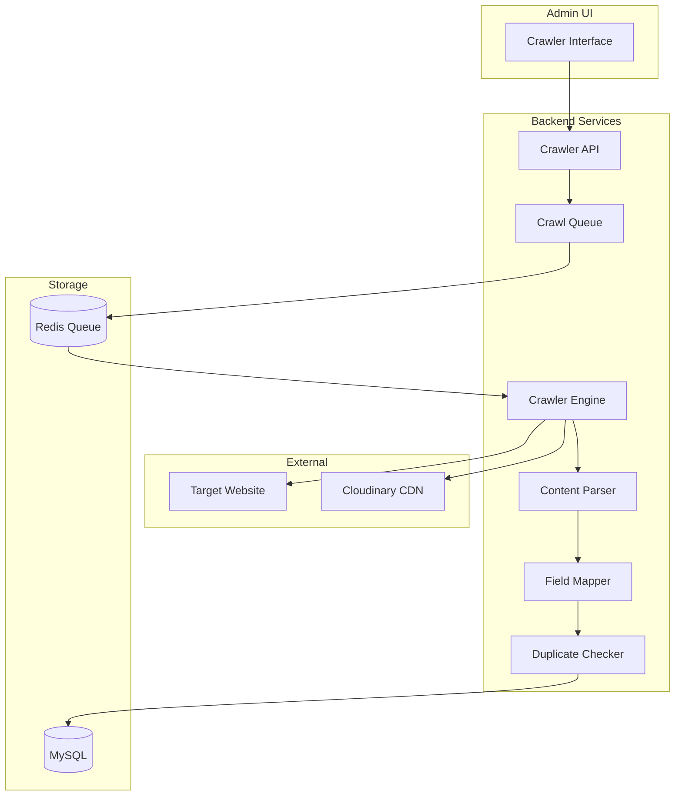
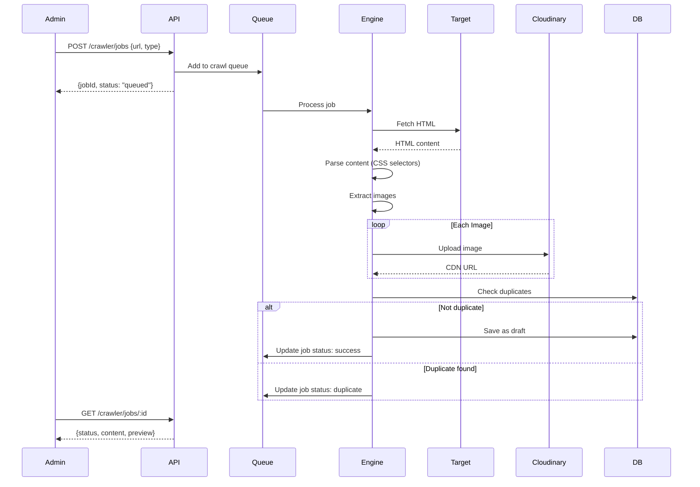
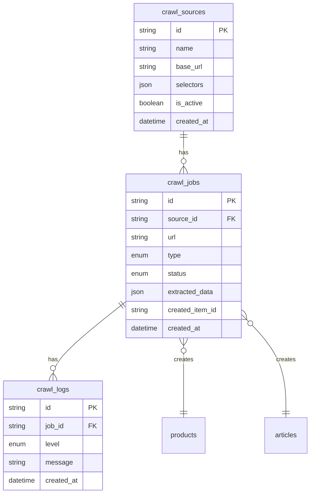
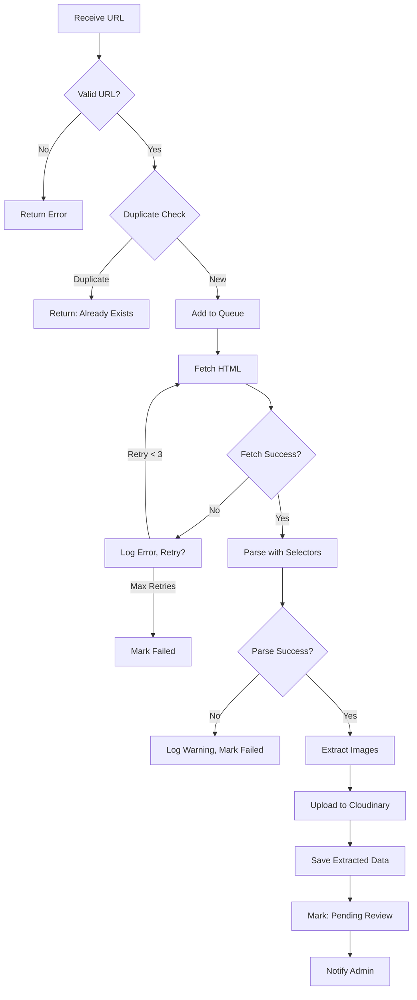
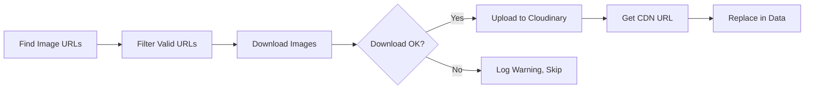
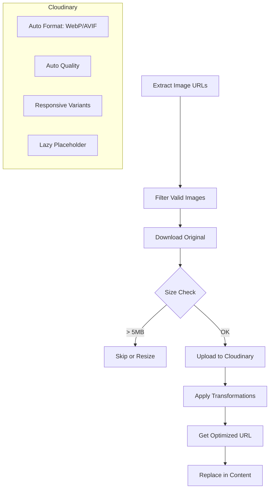

# Feature: Content Crawler (Trình Thu Thập Nội Dung)

> **Standard**: This document follows [../_doc_standard.md](../_doc_standard.md)

---

## 1. Overview

The **Content Crawler** is an admin tool that allows importing products and articles from external websites. It automates content collection to quickly build the catalog and article library.

### Purpose
- Rapidly populate product database from competitor/supplier sites
- Import articles for content curation
- Reduce manual data entry time

### Key Features
1. **URL-based Crawling**: Enter URL → Extract content
2. **Batch Import**: Multiple URLs at once
3. **Scheduled Crawling**: Auto-update from sources
4. **Content Mapping**: Map source fields to local fields
5. **Duplicate Detection**: Prevent duplicates via URL/title matching

---

## 2. Goals & Requirements

### 2.1 Functional Requirements

| ID | Requirement | Priority |
|----|-------------|----------|
| FR-001 | Admin can input a URL to crawl single product | Must |
| FR-002 | Admin can input a URL to crawl single article | Must |
| FR-003 | Admin can batch import multiple URLs | Should |
| FR-004 | System extracts title, description, images, price | Must |
| FR-005 | Admin can map CSS selectors for custom sites | Should |
| FR-006 | System detects and prevents duplicate imports | Must |
| FR-007 | Admin can edit content before saving | Must |
| FR-008 | System schedules automatic re-crawl | Could |
| FR-009 | Admin can preview extracted content | Must |
| FR-010 | System downloads and stores images to Cloudinary | Must |

### 2.2 Non-Functional Requirements

| ID | Requirement | Target |
|----|-------------|--------|
| NFR-001 | Single URL crawl completes in < 10 seconds | Performance |
| NFR-002 | System respects robots.txt | Compliance |
| NFR-003 | Rate limiting: max 10 requests/minute to same domain | Ethical |
| NFR-004 | Image downloads async, don't block UI | UX |
| NFR-005 | Support for JavaScript-rendered pages (optional) | Feature |

---

## 3. Architecture

### 3.1 System Diagram



### 3.2 Data Flow



---

## 4. Database Schema

### 4.1 Entity Relationship



### 4.2 Tables

#### crawl_sources
**Purpose**: Store website configurations with CSS selectors

```sql
CREATE TABLE crawl_sources (
    id CHAR(36) PRIMARY KEY DEFAULT (UUID()),
    name VARCHAR(100) NOT NULL,
    base_url VARCHAR(255) NOT NULL,
    
    -- CSS Selectors for content extraction
    selectors JSON NOT NULL,
    /*
    {
        "product": {
            "title": "h1.product-title",
            "price": ".price-current",
            "originalPrice": ".price-original",
            "description": ".product-description",
            "images": ".product-gallery img",
            "sku": ".product-sku"
        },
        "article": {
            "title": "h1.article-title",
            "content": ".article-body",
            "excerpt": ".article-excerpt",
            "featuredImage": ".article-featured img",
            "author": ".author-name",
            "publishDate": ".publish-date"
        }
    }
    */
    
    -- Rate limiting
    request_delay_ms INT DEFAULT 1000,
    max_concurrent INT DEFAULT 1,
    
    -- Auth if needed (basic auth, cookies)
    auth_config JSON,
    
    is_active BOOLEAN DEFAULT TRUE,
    created_at DATETIME DEFAULT NOW(),
    updated_at DATETIME DEFAULT NOW() ON UPDATE NOW(),
    
    INDEX idx_base_url (base_url)
) ENGINE=InnoDB DEFAULT CHARSET=utf8mb4;
```

#### crawl_jobs
**Purpose**: Track individual crawl tasks

```sql
CREATE TABLE crawl_jobs (
    id CHAR(36) PRIMARY KEY DEFAULT (UUID()),
    source_id CHAR(36),
    
    url VARCHAR(2048) NOT NULL,
    type ENUM('product', 'article') NOT NULL,
    status ENUM('queued', 'processing', 'success', 'failed', 'duplicate', 'pending_review') 
           DEFAULT 'queued',
    
    -- Extracted content before saving
    extracted_data JSON,
    /*
    {
        "title": "Product Name",
        "price": 199000,
        "images": ["https://cdn.../img1.jpg", "..."],
        "description": "<p>...</p>"
    }
    */
    
    -- Reference to created item (after admin approves)
    created_item_id CHAR(36),
    created_item_type ENUM('product', 'article'),
    
    -- Error tracking
    error_message TEXT,
    retry_count INT DEFAULT 0,
    
    -- Metadata
    created_by CHAR(36) NOT NULL,
    created_at DATETIME DEFAULT NOW(),
    processed_at DATETIME,
    
    INDEX idx_status (status),
    INDEX idx_url (url(255)),
    INDEX idx_created_at (created_at),
    FOREIGN KEY (source_id) REFERENCES crawl_sources(id) ON DELETE SET NULL,
    FOREIGN KEY (created_by) REFERENCES users(id)
) ENGINE=InnoDB DEFAULT CHARSET=utf8mb4;
```

#### crawl_logs
**Purpose**: Detailed logging for debugging

```sql
CREATE TABLE crawl_logs (
    id CHAR(36) PRIMARY KEY DEFAULT (UUID()),
    job_id CHAR(36) NOT NULL,
    
    level ENUM('info', 'warn', 'error') DEFAULT 'info',
    message TEXT NOT NULL,
    metadata JSON,
    
    created_at DATETIME DEFAULT NOW(),
    
    INDEX idx_job_id (job_id),
    FOREIGN KEY (job_id) REFERENCES crawl_jobs(id) ON DELETE CASCADE
) ENGINE=InnoDB DEFAULT CHARSET=utf8mb4;
```

### 4.3 Prisma Schema

```prisma
model CrawlSource {
  id              String   @id @default(uuid())
  name            String   @db.VarChar(100)
  baseUrl         String   @map("base_url") @db.VarChar(255)
  selectors       Json
  requestDelayMs  Int      @default(1000) @map("request_delay_ms")
  maxConcurrent   Int      @default(1) @map("max_concurrent")
  authConfig      Json?    @map("auth_config")
  isActive        Boolean  @default(true) @map("is_active")
  createdAt       DateTime @default(now()) @map("created_at")
  updatedAt       DateTime @updatedAt @map("updated_at")
  
  jobs CrawlJob[]
  
  @@map("crawl_sources")
}

model CrawlJob {
  id               String    @id @default(uuid())
  sourceId         String?   @map("source_id")
  url              String    @db.VarChar(2048)
  type             CrawlType
  status           CrawlStatus @default(queued)
  extractedData    Json?     @map("extracted_data")
  createdItemId    String?   @map("created_item_id")
  createdItemType  CrawlType? @map("created_item_type")
  errorMessage     String?   @map("error_message") @db.Text
  retryCount       Int       @default(0) @map("retry_count")
  createdBy        String    @map("created_by")
  createdAt        DateTime  @default(now()) @map("created_at")
  processedAt      DateTime? @map("processed_at")
  
  source CrawlSource? @relation(fields: [sourceId], references: [id])
  user   User         @relation(fields: [createdBy], references: [id])
  logs   CrawlLog[]
  
  @@index([status])
  @@index([url])
  @@map("crawl_jobs")
}

model CrawlLog {
  id        String     @id @default(uuid())
  jobId     String     @map("job_id")
  level     LogLevel   @default(info)
  message   String     @db.Text
  metadata  Json?
  createdAt DateTime   @default(now()) @map("created_at")
  
  job CrawlJob @relation(fields: [jobId], references: [id], onDelete: Cascade)
  
  @@index([jobId])
  @@map("crawl_logs")
}

enum CrawlType {
  product
  article
}

enum CrawlStatus {
  queued
  processing
  success
  failed
  duplicate
  pending_review
}

enum LogLevel {
  info
  warn
  error
}
```

---

## 5. API Endpoints

### Base URL
```
/api/v1/admin/crawler
```

### Authentication
- Requires JWT with `admin` role

---

### 5.1 Create Crawl Job

```http
POST /crawler/jobs
Authorization: Bearer {admin_token}
Content-Type: application/json
```

**Request Body**:
```json
{
  "url": "https://example.com/product/vitamin-c",
  "type": "product",
  "sourceId": "uuid-of-source-config"  // Optional, auto-detect if not provided
}
```

**Response** (201 Created):
```json
{
  "success": true,
  "data": {
    "job": {
      "id": "job-uuid",
      "url": "https://example.com/product/vitamin-c",
      "type": "product",
      "status": "queued",
      "createdAt": "2024-12-17T10:00:00Z"
    }
  }
}
```

---

### 5.2 Batch Create Jobs

```http
POST /crawler/jobs/batch
Authorization: Bearer {admin_token}
Content-Type: application/json
```

**Request Body**:
```json
{
  "urls": [
    "https://example.com/product/1",
    "https://example.com/product/2",
    "https://example.com/product/3"
  ],
  "type": "product",
  "sourceId": "uuid"
}
```

**Response**:
```json
{
  "success": true,
  "data": {
    "created": 3,
    "duplicates": 0,
    "jobs": [
      { "id": "job-1", "url": "...", "status": "queued" },
      { "id": "job-2", "url": "...", "status": "queued" },
      { "id": "job-3", "url": "...", "status": "queued" }
    ]
  }
}
```

---

### 5.3 Get Job Status

```http
GET /crawler/jobs/:id
Authorization: Bearer {admin_token}
```

**Response** (Processing):
```json
{
  "success": true,
  "data": {
    "job": {
      "id": "job-uuid",
      "status": "processing",
      "progress": 60,
      "logs": [
        { "level": "info", "message": "Fetching page...", "time": "..." },
        { "level": "info", "message": "Extracting content...", "time": "..." }
      ]
    }
  }
}
```

**Response** (Success - Ready for Review):
```json
{
  "success": true,
  "data": {
    "job": {
      "id": "job-uuid",
      "status": "pending_review",
      "extractedData": {
        "title": "Vitamin C 1000mg",
        "price": 250000,
        "salePrice": 199000,
        "description": "<p>Mô tả sản phẩm...</p>",
        "images": [
          "https://res.cloudinary.com/xxx/imported/img1.jpg",
          "https://res.cloudinary.com/xxx/imported/img2.jpg"
        ],
        "sku": "VIT-C-1000",
        "sourceUrl": "https://example.com/product/vitamin-c"
      },
      "preview": {
        "type": "product",
        "html": "<rendered preview>"
      }
    }
  }
}
```

---

### 5.4 List Jobs

```http
GET /crawler/jobs?status=pending_review&type=product&page=1&limit=20
Authorization: Bearer {admin_token}
```

**Query Parameters**:
| Param | Type | Description |
|-------|------|-------------|
| status | string | Filter by status |
| type | string | product / article |
| page | number | Pagination |
| limit | number | Items per page |

---

### 5.5 Approve & Save Content

```http
POST /crawler/jobs/:id/approve
Authorization: Bearer {admin_token}
Content-Type: application/json
```

**Request Body** (Admin can modify before saving):
```json
{
  "data": {
    "title": "Vitamin C 1000mg - Edited Title",
    "price": 199000,
    "categoryId": "category-uuid",
    "status": "draft"
  },
  "saveAs": "product"
}
```

**Response**:
```json
{
  "success": true,
  "data": {
    "createdItem": {
      "id": "product-uuid",
      "type": "product",
      "title": "Vitamin C 1000mg - Edited Title",
      "slug": "vitamin-c-1000mg-edited-title"
    },
    "job": {
      "id": "job-uuid",
      "status": "success"
    }
  }
}
```

---

### 5.6 Reject Job

```http
POST /crawler/jobs/:id/reject
Authorization: Bearer {admin_token}
```

**Response**:
```json
{
  "success": true,
  "message": "Job rejected and removed"
}
```

---

### 5.7 Manage Sources (CRUD)

```http
GET    /crawler/sources
POST   /crawler/sources
GET    /crawler/sources/:id
PUT    /crawler/sources/:id
DELETE /crawler/sources/:id
```

**Create Source Request**:
```json
{
  "name": "Example Store",
  "baseUrl": "https://example.com",
  "selectors": {
    "product": {
      "title": "h1.product-name",
      "price": ".price-box .price",
      "originalPrice": ".price-box .old-price",
      "description": ".product-description",
      "images": ".product-gallery img[src]",
      "sku": ".product-sku"
    }
  },
  "requestDelayMs": 2000
}
```

---

### 5.8 Test Selectors

```http
POST /crawler/test
Authorization: Bearer {admin_token}
Content-Type: application/json
```

**Request**:
```json
{
  "url": "https://example.com/product/test",
  "selectors": {
    "title": "h1.product-name",
    "price": ".price"
  }
}
```

**Response**:
```json
{
  "success": true,
  "data": {
    "results": {
      "title": "Extracted Title",
      "price": "199,000đ"
    },
    "raw": {
      "title": { "found": true, "elements": 1 },
      "price": { "found": true, "elements": 1 }
    }
  }
}
```

---

## 6. Business Logic

### 6.1 Crawl Process Flow



### 6.2 Image Processing



### 6.3 Duplicate Detection

**Strategy**: Check by URL hash and title similarity

```typescript
async function checkDuplicate(url: string, type: CrawlType): Promise<boolean> {
  // 1. Exact URL match
  const urlHash = hashUrl(url);
  const existingJob = await db.crawlJob.findFirst({
    where: { url, status: { in: ['success', 'pending_review'] } }
  });
  if (existingJob) return true;
  
  // 2. Check if product/article with same URL exists
  if (type === 'product') {
    const existingProduct = await db.product.findFirst({
      where: { sourceUrl: url }
    });
    if (existingProduct) return true;
  }
  
  return false;
}
```

---

## 7. Security Considerations

### 7.1 Authentication & Authorization
- Admin role required for all endpoints
- All actions logged with user ID

### 7.2 Input Validation
```typescript
const crawlJobSchema = z.object({
  url: z.string().url().max(2048),
  type: z.enum(['product', 'article']),
  sourceId: z.string().uuid().optional()
});

// Validate URL is not internal
function validateUrl(url: string): boolean {
  const parsed = new URL(url);
  const blocked = ['localhost', '127.0.0.1', '0.0.0.0', 'internal'];
  return !blocked.some(b => parsed.hostname.includes(b));
}
```

### 7.3 Rate Limiting
- Max 10 crawl requests per minute per admin
- Max 1 request per second to same domain
- Respect robots.txt

### 7.4 Content Sanitization
```typescript
// Sanitize HTML content before storing
import DOMPurify from 'isomorphic-dompurify';

function sanitizeContent(html: string): string {
  return DOMPurify.sanitize(html, {
    ALLOWED_TAGS: ['p', 'br', 'strong', 'em', 'ul', 'ol', 'li', 'h2', 'h3', 'a', 'img'],
  });
}
```

### 7.5 HTML Content Cleaning (Làm sạch nội dung HTML)

Khi lấy nội dung từ các trang web, cần loại bỏ các element không mong muốn:

#### 7.5.1 Elements cần xóa bỏ hoàn toàn

```typescript
// Danh sách các element cần xóa bỏ hoàn toàn
const REMOVE_ELEMENTS = [
  // Script & Style
  'script', 'style', 'noscript', 'template',
  
  // Interactive elements - không cần trong content
  'iframe', 'form', 'input', 'button', 'select', 'textarea', 'dialog',
  
  // Layout elements - thường là navigation/sidebar
  'nav', 'header', 'footer', 'aside',
  '[role="navigation"]', '[role="banner"]', '[role="complementary"]',
  
  // Media controls (handle separately)
  'video', 'audio', 'canvas', 'object', 'embed', 'svg',
  
  // Common classes to remove
  '.advertisement', '.ads', '.ad-container', '[data-ad]',
  '.social-share', '.share-buttons', '.like-buttons',
  '.comment-section', '.comments', '.fb-comments',
  '.related-posts', '.related-articles',
  '.breadcrumb', '.pagination',
  '.newsletter-signup', '.popup', '.modal',
  '.sidebar', '.widget', '.menu',
];

function removeUnwantedElements($: CheerioAPI, customRemove: string[] = []): void {
  const allSelectors = [...REMOVE_ELEMENTS, ...customRemove];
  allSelectors.forEach(selector => $(selector).remove());
}
```

#### 7.5.2 Attributes cần xóa bỏ

```typescript
const REMOVE_ATTRIBUTES = [
  // Event handlers
  'onclick', 'onload', 'onerror', 'onmouseover', 'onmouseout',
  'onfocus', 'onblur', 'onsubmit', 'onchange', 'onkeydown', 'onkeyup',
  
  // Tracking & Analytics
  'data-ga', 'data-gtm', 'data-analytics', 'data-tracking',
  
  // JavaScript hooks
  'data-action', 'data-controller', 'data-target', 'data-toggle',
];

// Class patterns to filter out
const REMOVE_CLASS_PATTERNS = [
  /^js-/, /^data-/, /-ad$/, /^tracking/, /^gtm-/, /^ga-/
];

function cleanAttributes($: CheerioAPI): void {
  $('*').each((_, el) => {
    REMOVE_ATTRIBUTES.forEach(attr => $(el).removeAttr(attr));
    
    // Filter classes
    const classes = $(el).attr('class');
    if (classes) {
      const clean = classes.split(' ')
        .filter(c => !REMOVE_CLASS_PATTERNS.some(p => p.test(c)))
        .join(' ');
      clean ? $(el).attr('class', clean) : $(el).removeAttr('class');
    }
  });
}
```

#### 7.5.3 Cấu hình per-source

```json
{
  "selectors": { "article": { "title": "h1", "content": ".article-body" } },
  "removeElements": [".author-bio", ".related-posts", "[data-testid='ad']"],
  "removeAttributes": ["data-src-set", "data-component"],
  "keepAttributes": ["src", "href", "alt", "title", "class"]
}
```

---

### 7.6 Pagination Handling (Xử lý phân trang)

#### 7.6.1 Các loại phân trang

| Loại | Ví dụ | Cách xử lý |
|------|-------|------------|
| **Numbered URL** | `?page=2`, `/page/2` | Crawl tuần tự thay đổi param |
| **Next/Prev link** | `<a class="next">` | Follow link selector |
| **Load More button** | AJAX button | Cần JS rendering (Phase 2) |
| **Infinite scroll** | Scroll triggers load | Cần JS rendering (Phase 2) |

#### 7.6.2 Cấu hình

```json
{
  "pagination": {
    "enabled": true,
    "type": "numbered",
    "maxPages": 10,
    "nextSelector": "a.next-page",
    "pageParam": "page",
    "pagePattern": "/page/{N}",
    "delay": 2000
  }
}
```

#### 7.6.3 Logic crawl phân trang

```typescript
async function crawlPaginated(startUrl: string, config: PaginationConfig): Promise<string[]> {
  const urls: string[] = [];
  let page = 1;
  let currentUrl = startUrl;
  
  while (page <= config.maxPages) {
    const html = await fetchPage(currentUrl);
    const items = extractItemUrls(html, config.itemSelector);
    urls.push(...items);
    
    if (items.length === 0) break;
    
    // Build next page URL
    if (config.type === 'next_link') {
      const $ = cheerio.load(html);
      const next = $(config.nextSelector).attr('href');
      if (!next) break;
      currentUrl = new URL(next, currentUrl).href;
    } else {
      page++;
      currentUrl = config.pagePattern
        ? startUrl.replace('{N}', String(page))
        : `${startUrl}${startUrl.includes('?') ? '&' : '?'}${config.pageParam}=${page}`;
    }
    
    await delay(config.delay);
  }
  
  return urls;
}
```

---

### 7.7 Lazy Loading Handling

#### 7.7.1 Các lazy-load attributes phổ biến

```typescript
const LAZY_LOAD_ATTRS = [
  'data-src', 'data-lazy-src', 'data-original',
  'data-srcset', 'data-lazy-srcset',
  'data-bg', 'data-background-image',
  'nitro-lazy-src', // Nitropack
];

function resolveLazyImages($: CheerioAPI): void {
  $('img').each((_, el) => {
    for (const attr of LAZY_LOAD_ATTRS) {
      const src = $(el).attr(attr);
      if (src?.startsWith('http')) {
        $(el).attr('src', src);
        $(el).removeAttr(attr);
        break;
      }
    }
  });
}
```

#### 7.7.2 Infinite Scroll & JS Rendering (Phase 2)

Đối với trang cần JavaScript:

```typescript
interface JsRenderConfig {
  enabled: boolean;
  waitFor: 'networkidle0' | 'networkidle2' | 'domcontentloaded' | 'selector';
  waitSelector?: string;
  scrollToBottom?: boolean;
  scrollDelay?: number;
  maxScrolls?: number;
}

// Puppeteer implementation (Phase 2)
async function renderWithJs(url: string, config: JsRenderConfig): Promise<string> {
  const browser = await puppeteer.launch({ headless: true });
  const page = await browser.newPage();
  await page.goto(url, { waitUntil: config.waitFor });
  
  if (config.scrollToBottom) {
    for (let i = 0; i < (config.maxScrolls || 3); i++) {
      await page.evaluate(() => window.scrollTo(0, document.body.scrollHeight));
      await new Promise(r => setTimeout(r, config.scrollDelay || 1000));
    }
  }
  
  const html = await page.content();
  await browser.close();
  return html;
}
```

---

### 7.8 Image Extraction

#### 7.8.1 Các nguồn ảnh cần xét

```typescript
function extractImages($: CheerioAPI, baseUrl: string): string[] {
  const images = new Set<string>();
  
  // 1. Standard img
  $('img[src]').each((_, el) => images.add(resolve($(el).attr('src')!, baseUrl)));
  
  // 2. Srcset (highest res)
  $('img[srcset]').each((_, el) => {
    const highest = getHighestResSrcset($(el).attr('srcset')!);
    if (highest) images.add(resolve(highest, baseUrl));
  });
  
  // 3. Lazy-load attributes
  LAZY_LOAD_ATTRS.forEach(attr => {
    $(`[${attr}]`).each((_, el) => {
      const src = $(el).attr(attr);
      if (src?.startsWith('http')) images.add(src);
    });
  });
  
  // 4. OG image
  const ogImage = $('meta[property="og:image"]').attr('content');
  if (ogImage) images.add(resolve(ogImage, baseUrl));
  
  return Array.from(images).filter(isValidImage);
}
```

#### 7.8.2 Filter ảnh hợp lệ

```typescript
const SKIP_PATTERNS = [
  /1x1\./, /pixel\./, /beacon\./, /\.gif\?/, // Tracking
  /gravatar/, /avatar/, /icon/i, /logo/i,     // UI elements
  /placeholder/, /blank\./, /spacer\./,       // Placeholders
  /doubleclick/, /googlesyndication/,         // Ads
];

function isValidImage(url: string): boolean {
  return !SKIP_PATTERNS.some(p => p.test(url));
}
```

---

### 7.9 Complete Source Configuration Example

```json
{
  "name": "VnExpress",
  "baseUrl": "https://vnexpress.net",
  "crawlType": "article",
  "selectors": {
    "article": {
      "title": "h1.title-detail",
      "content": "article.fck_detail",
      "excerpt": "p.description",
      "featuredImage": "meta[property='og:image']::attr(content)",
      "author": "p.author_mail strong",
      "publishDate": "span.date"
    }
  },
  "removeElements": [
    ".box_comment", ".box_like", ".box_share",
    ".box_author", ".banner-ads", ".box_tinlienquan"
  ],
  "pagination": { "enabled": false },
  "lazyLoad": { "imageAttr": "data-src" },
  "jsRender": { "enabled": false },
  "encoding": "utf-8",
  "requestHeaders": { "Accept-Language": "vi-VN,vi;q=0.9" }
}
```

---

### 7.10 Text Transformation & Replacement (Biến đổi & Thay thế văn bản)

Mỗi field có thể có các quy tắc biến đổi riêng:

#### 7.10.1 Cấu hình transformations per-field

```json
{
  "selectors": {
    "article": {
      "title": {
        "selector": "h1.title",
        "transforms": [
          { "type": "trim" },
          { "type": "replace", "find": " - VnExpress", "replace": "" },
          { "type": "regex", "pattern": "\\s+", "replace": " " },
          { "type": "maxLength", "value": 200 }
        ]
      },
      "content": {
        "selector": ".article-body",
        "transforms": [
          { "type": "removeEmptyTags" },
          { "type": "replace", "find": "độc giả", "replace": "bạn đọc" },
          { "type": "regex", "pattern": "\\[.*?\\]", "replace": "" }
        ]
      },
      "excerpt": {
        "selector": ".description",
        "transforms": [
          { "type": "stripTags" },
          { "type": "maxLength", "value": 300, "ellipsis": "..." }
        ]
      }
    },
    "product": {
      "price": {
        "selector": ".price-current",
        "transforms": [
          { "type": "stripTags" },
          { "type": "regex", "pattern": "[^0-9]", "replace": "" },
          { "type": "toNumber" }
        ]
      },
      "name": {
        "selector": "h1.product-name",
        "transforms": [
          { "type": "trim" },
          { "type": "replace", "find": " - Giảm giá sốc", "replace": "" }
        ]
      }
    }
  }
}
```

#### 7.10.2 Các loại transform hỗ trợ

| Type | Mô tả | Ví dụ |
|------|-------|-------|
| `trim` | Xóa khoảng trắng đầu/cuối | `"  hello  "` → `"hello"` |
| `stripTags` | Xóa tất cả HTML tags | `"<p>text</p>"` → `"text"` |
| `replace` | Thay thế text cố định | `find: "A", replace: "B"` |
| `regex` | Thay thế bằng regex | `pattern: "\\d+", replace: "X"` |
| `maxLength` | Giới hạn độ dài | `value: 200, ellipsis: "..."` |
| `toNumber` | Chuyển thành số | `"199,000đ"` → `199000` |
| `toLower` | Chuyển thường | `"HELLO"` → `"hello"` |
| `toUpper` | Chuyển HOA | `"hello"` → `"HELLO"` |
| `removeEmptyTags` | Xóa tags rỗng | `<p></p>` → removed |
| `decodeHtml` | Decode HTML entities | `&amp;` → `&` |
| `addPrefix` | Thêm prefix | `"[Import] " + title` |
| `addSuffix` | Thêm suffix | `title + " | MySite"` |

#### 7.10.3 Implementation

```typescript
interface Transform {
  type: string;
  find?: string;
  replace?: string;
  pattern?: string;
  value?: number;
  ellipsis?: string;
}

function applyTransforms(value: string, transforms: Transform[]): string {
  let result = value;
  
  for (const t of transforms) {
    switch (t.type) {
      case 'trim':
        result = result.trim();
        break;
      case 'stripTags':
        result = result.replace(/<[^>]*>/g, '');
        break;
      case 'replace':
        result = result.replaceAll(t.find!, t.replace!);
        break;
      case 'regex':
        result = result.replace(new RegExp(t.pattern!, 'g'), t.replace!);
        break;
      case 'maxLength':
        if (result.length > t.value!) {
          result = result.slice(0, t.value!) + (t.ellipsis || '');
        }
        break;
      case 'toNumber':
        result = result.replace(/[^\d]/g, '');
        break;
      case 'toLower':
        result = result.toLowerCase();
        break;
      case 'removeEmptyTags':
        result = result.replace(/<(\w+)[^>]*>\s*<\/\1>/g, '');
        break;
      case 'decodeHtml':
        result = decodeHtmlEntities(result);
        break;
      case 'addPrefix':
        result = t.value + result;
        break;
      case 'addSuffix':
        result = result + t.value;
        break;
    }
  }
  
  return result;
}
```

---

### 7.11 SEO Metadata Extraction

#### 7.11.1 Các nguồn SEO metadata

```typescript
interface SeoMetadata {
  metaTitle?: string;
  metaDescription?: string;
  canonicalUrl?: string;
  ogImage?: string;
  keywords?: string[];
}

function extractSeoMetadata($: CheerioAPI): SeoMetadata {
  return {
    // Title priority: og:title > title tag > h1
    metaTitle: 
      $('meta[property="og:title"]').attr('content') ||
      $('title').text() ||
      $('h1').first().text(),
    
    // Description priority: og:description > meta description > excerpt
    metaDescription:
      $('meta[property="og:description"]').attr('content') ||
      $('meta[name="description"]').attr('content'),
    
    // Canonical
    canonicalUrl: $('link[rel="canonical"]').attr('href'),
    
    // OG Image
    ogImage: $('meta[property="og:image"]').attr('content'),
    
    // Keywords
    keywords: $('meta[name="keywords"]').attr('content')?.split(',').map(k => k.trim())
  };
}
```

#### 7.11.2 Cấu hình SEO per-source

```json
{
  "seo": {
    "extractMeta": true,
    "generateFromContent": true,
    "metaTitleSelector": "meta[property='og:title']::attr(content)",
    "metaDescriptionSelector": "meta[name='description']::attr(content)",
    "metaTitleTransforms": [
      { "type": "replace", "find": " | SourceSite", "replace": "" },
      { "type": "maxLength", "value": 60 }
    ],
    "metaDescriptionTransforms": [
      { "type": "maxLength", "value": 160 }
    ],
    "autoGenerateIfMissing": {
      "metaTitle": "useTitle",
      "metaDescription": "fromExcerpt:160"
    }
  }
}
```

---

### 7.12 Image Optimization (Tối ưu hình ảnh)

#### 7.12.1 Quy trình xử lý hình ảnh



#### 7.12.2 Cấu hình Cloudinary optimization

```typescript
interface ImageConfig {
  maxSizeMB: number;
  cloudinaryFolder: string;
  transformations: {
    featuredImage: CloudinaryTransform;
    contentImages: CloudinaryTransform;
    thumbnail: CloudinaryTransform;
  };
  generateVariants: boolean;
  lazyPlaceholder: 'blur' | 'color' | 'none';
}

const defaultImageConfig: ImageConfig = {
  maxSizeMB: 5,
  cloudinaryFolder: 'imported',
  transformations: {
    featuredImage: {
      width: 1200,
      height: 630,
      crop: 'fill',
      quality: 'auto:best',
      format: 'auto'
    },
    contentImages: {
      width: 800,
      quality: 'auto:good',
      format: 'auto'
    },
    thumbnail: {
      width: 400,
      height: 300,
      crop: 'fill',
      quality: 'auto:eco',
      format: 'auto'
    }
  },
  generateVariants: true,
  lazyPlaceholder: 'blur'
};
```

#### 7.12.3 Upload và tối ưu

```typescript
async function processImage(imageUrl: string, config: ImageConfig): Promise<ProcessedImage> {
  // 1. Download image
  const response = await fetch(imageUrl);
  const buffer = await response.arrayBuffer();
  
  // 2. Check size
  const sizeMB = buffer.byteLength / (1024 * 1024);
  if (sizeMB > config.maxSizeMB) {
    throw new Error(`Image too large: ${sizeMB.toFixed(2)}MB`);
  }
  
  // 3. Upload to Cloudinary with transformations
  const result = await cloudinary.uploader.upload_stream({
    folder: config.cloudinaryFolder,
    resource_type: 'image',
    eager: [
      config.transformations.featuredImage,
      config.transformations.thumbnail
    ],
    eager_async: true
  });
  
  // 4. Return processed URLs
  return {
    original: result.secure_url,
    featured: result.eager[0].secure_url,
    thumbnail: result.eager[1].secure_url,
    blurHash: await generateBlurHash(buffer)
  };
}
```

#### 7.12.4 Responsive image replacement

```typescript
function replaceImagesWithResponsive($: CheerioAPI, imageMap: Map<string, ProcessedImage>): void {
  $('img').each((_, el) => {
    const originalSrc = $(el).attr('src');
    const processed = imageMap.get(originalSrc);
    
    if (processed) {
      // Replace with Cloudinary responsive URL
      const responsiveUrl = `${processed.original.replace('/upload/', '/upload/f_auto,q_auto,w_auto/')}`;
      
      $(el).attr('src', responsiveUrl);
      $(el).attr('data-blur', processed.blurHash);
      $(el).attr('loading', 'lazy');
      
      // Add srcset for responsive
      $(el).attr('srcset', `
        ${getVariant(processed.original, 400)} 400w,
        ${getVariant(processed.original, 800)} 800w,
        ${getVariant(processed.original, 1200)} 1200w
      `);
      $(el).attr('sizes', '(max-width: 400px) 400px, (max-width: 800px) 800px, 1200px');
    }
  });
}
```

---

### 7.13 Proxy & Anti-bot Support

#### 7.13.1 Cấu hình proxy

```json
{
  "proxy": {
    "enabled": false,
    "type": "http",
    "host": "proxy.example.com",
    "port": 8080,
    "auth": {
      "username": "user",
      "password": "pass"
    },
    "rotateOnError": true,
    "proxyList": [
      "http://proxy1:8080",
      "http://proxy2:8080"
    ]
  }
}
```

#### 7.13.2 Request customization

```typescript
interface RequestConfig {
  headers: Record<string, string>;
  cookies?: string;
  proxy?: ProxyConfig;
  timeout: number;
  retries: number;
  userAgentRotation: boolean;
}

const USER_AGENTS = [
  'Mozilla/5.0 (Windows NT 10.0; Win64; x64) AppleWebKit/537.36...',
  'Mozilla/5.0 (Macintosh; Intel Mac OS X 10_15_7) AppleWebKit/537.36...',
  // ...more agents
];

async function fetchWithConfig(url: string, config: RequestConfig): Promise<string> {
  const headers = {
    ...config.headers,
    'User-Agent': config.userAgentRotation 
      ? USER_AGENTS[Math.floor(Math.random() * USER_AGENTS.length)]
      : config.headers['User-Agent']
  };
  
  const response = await fetch(url, {
    headers,
    signal: AbortSignal.timeout(config.timeout),
    // Apply proxy if configured
  });
  
  return response.text();
}
```

---

### 7.14 AI Content Rewriting (Phase 2)

Tích hợp AI để biến đổi nội dung:

```json
{
  "aiRewrite": {
    "enabled": false,
    "provider": "openai",
    "model": "gpt-4",
    "tasks": {
      "title": {
        "enabled": true,
        "prompt": "Rewrite this title to be more engaging while keeping the same meaning. Keep it under 60 characters. Original: {value}"
      },
      "excerpt": {
        "enabled": true,
        "prompt": "Summarize this in 2 sentences for Vietnamese readers: {value}"
      },
      "content": {
        "enabled": false,
        "prompt": "Rewrite this article in a more conversational tone..."
      }
    },
    "translate": {
      "enabled": false,
      "targetLanguage": "vi",
      "provider": "deepl"
    }
  }
}
```

---

### 7.15 Enhanced Duplicate Detection

#### 7.15.1 Các phương pháp phát hiện trùng lặp

| Method | Mô tả | Use Case |
|--------|-------|----------|
| **URL exact** | So sánh URL chính xác | Default |
| **URL normalized** | Chuẩn hóa URL (bỏ tracking params) | Recommended |
| **Title exact** | So sánh tiêu đề | Fallback |
| **Title similarity** | So sánh độ tương tự (Levenshtein) | Fuzzy matching |
| **Content hash** | Hash nội dung | Detect copied content |

#### 7.15.2 Cấu hình

```json
{
  "duplicateCheck": {
    "enabled": true,
    "methods": ["url_normalized", "title_similarity"],
    "urlParams_ignore": ["utm_source", "utm_medium", "ref", "fbclid"],
    "titleSimilarityThreshold": 0.85,
    "action": "skip"
  }
}
```

#### 7.15.3 Implementation

```typescript
function normalizeUrl(url: string, ignoreParams: string[]): string {
  const parsed = new URL(url);
  ignoreParams.forEach(p => parsed.searchParams.delete(p));
  return parsed.href.toLowerCase().replace(/\/$/, '');
}

function titleSimilarity(a: string, b: string): number {
  const normalize = (s: string) => s.toLowerCase().replace(/[^\w\s]/g, '').trim();
  const na = normalize(a);
  const nb = normalize(b);
  
  // Levenshtein distance based similarity
  const distance = levenshtein(na, nb);
  const maxLen = Math.max(na.length, nb.length);
  return 1 - (distance / maxLen);
}

async function isDuplicate(
  url: string, 
  title: string, 
  config: DuplicateConfig
): Promise<{ isDuplicate: boolean; reason?: string; existingId?: string }> {
  // Check URL
  if (config.methods.includes('url_normalized')) {
    const normalizedUrl = normalizeUrl(url, config.urlParams_ignore);
    const existing = await db.article.findFirst({
      where: { sourceUrl: normalizedUrl }
    });
    if (existing) {
      return { isDuplicate: true, reason: 'URL match', existingId: existing.id };
    }
  }
  
  // Check title similarity
  if (config.methods.includes('title_similarity') && title) {
    const recent = await db.article.findMany({
      select: { id: true, title: true },
      orderBy: { createdAt: 'desc' },
      take: 100
    });
    
    for (const article of recent) {
      if (titleSimilarity(title, article.title) >= config.titleSimilarityThreshold) {
        return { isDuplicate: true, reason: 'Title similar', existingId: article.id };
      }
    }
  }
  
  return { isDuplicate: false };
}
```

---

| Error Code | Description | Resolution |
|------------|-------------|------------|
| CRAWLER_001 | Invalid URL format | Check URL format |
| CRAWLER_002 | URL already crawled | Use existing data or force re-crawl |
| CRAWLER_003 | Failed to fetch page | Check URL accessibility |
| CRAWLER_004 | No content extracted | Update CSS selectors |
| CRAWLER_005 | Image upload failed | Retry or skip images |
| CRAWLER_006 | Unknown source domain | Create source config first |
| CRAWLER_007 | Rate limit exceeded | Wait and retry |
| CRAWLER_008 | robots.txt disallow | Cannot crawl this page |

---

## 9. Testing Strategy

### 9.1 Unit Tests
```typescript
describe('ContentParser', () => {
  it('should extract product data with valid selectors', async () => {
    const html = '<h1 class="title">Test Product</h1><span class="price">199000</span>';
    const selectors = { title: 'h1.title', price: '.price' };
    
    const result = await parser.parse(html, selectors);
    
    expect(result.title).toBe('Test Product');
    expect(result.price).toBe('199000');
  });
  
  it('should handle missing elements gracefully', async () => {
    const html = '<h1 class="title">Test</h1>';
    const selectors = { title: 'h1.title', price: '.price' };
    
    const result = await parser.parse(html, selectors);
    
    expect(result.title).toBe('Test');
    expect(result.price).toBeNull();
  });
});
```

### 9.2 Integration Tests
```typescript
describe('POST /crawler/jobs', () => {
  it('should create crawl job and return job ID', async () => {
    const response = await request(app)
      .post('/api/v1/admin/crawler/jobs')
      .set('Authorization', `Bearer ${adminToken}`)
      .send({
        url: 'https://example.com/product/1',
        type: 'product'
      });
    
    expect(response.status).toBe(201);
    expect(response.body.data.job.id).toBeDefined();
    expect(response.body.data.job.status).toBe('queued');
  });
});
```

### 9.3 E2E Tests
```typescript
describe('Crawler Flow', () => {
  it('should crawl, extract, and save product', async () => {
    // Create job
    const createRes = await api.post('/crawler/jobs', { url, type: 'product' });
    const jobId = createRes.data.job.id;
    
    // Wait for processing
    await waitFor(async () => {
      const status = await api.get(`/crawler/jobs/${jobId}`);
      return status.data.job.status === 'pending_review';
    }, { timeout: 30000 });
    
    // Approve
    const approveRes = await api.post(`/crawler/jobs/${jobId}/approve`, {
      data: { categoryId: 'cat-123' },
      saveAs: 'product'
    });
    
    expect(approveRes.data.createdItem.id).toBeDefined();
  });
});
```

---

## 10. Dependencies

### External Libraries
| Library | Purpose | Version |
|---------|---------|---------|
| `cheerio` | HTML parsing | ^1.0.0 |
| `axios` | HTTP requests | ^1.6.0 |
| `p-queue` | Request rate limiting | ^7.0.0 |
| `robots-parser` | Parse robots.txt | ^3.0.0 |
| `isomorphic-dompurify` | HTML sanitization | ^2.0.0 |
| `bullmq` | Job queue (Redis) | ^5.0.0 |

### Internal Dependencies
- Cloudinary service (image upload)
- Redis (job queue)
- Products module (for saving)
- Articles module (for saving)

---

## 11. Configuration

| Variable | Description | Default |
|----------|-------------|---------|
| `CRAWLER_MAX_CONCURRENT` | Max concurrent crawl jobs | 5 |
| `CRAWLER_DEFAULT_DELAY_MS` | Default delay between requests | 1000 |
| `CRAWLER_MAX_RETRIES` | Max retry attempts | 3 |
| `CRAWLER_TIMEOUT_MS` | Request timeout | 30000 |
| `CRAWLER_USER_AGENT` | User agent string | "Mozilla/5.0 ..." |
| `CRAWLER_IMAGE_MAX_SIZE_MB` | Max image size to download | 5 |

---

## 12. Deployment Notes

### 12.1 Migration Steps
1. Run database migrations for new tables
2. Set environment variables
3. Initialize Redis queue
4. Deploy crawler worker service

### 12.2 Feature Flags
```typescript
const FEATURE_FLAGS = {
  CRAWLER_ENABLED: true,
  CRAWLER_AUTO_SCHEDULE: false,  // Phase 2
  CRAWLER_JS_RENDER: false       // Phase 2 - Puppeteer
};
```

### 12.3 Rollback Plan
1. Disable feature flag
2. Stop crawler worker
3. Keep data for manual review

---

## 13. Future Enhancements (Phase 2)

| Feature | Description |
|---------|-------------|
| **JS Rendering** | Use Puppeteer for JS-heavy sites |
| **Auto-scheduling** | Cron jobs for periodic re-crawl |
| **Smart Mapping** | AI-assisted selector detection |
| **Category Mapping** | Auto-assign categories |
| **Price Monitoring** | Track price changes from sources |
